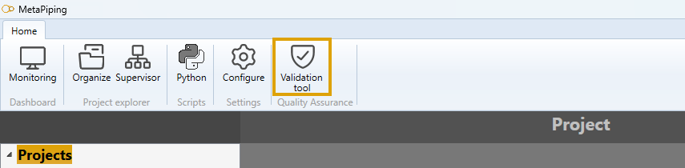
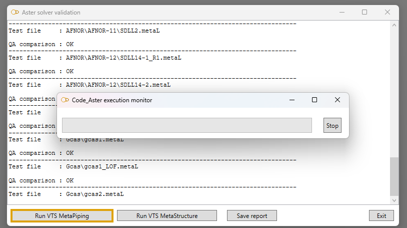

# Quality Assurance

To ensure quality assurance of Aster solver, MetaPiping & MetaStructure provide a tool that execute piping and structure projects and compare the results to official references.

**Piping references :**

* Piping calculation software PIPESTRESS 4.2 FOLIO: 5/165 
* RCC-M Code, 2002 to 2020 editions: “Design and construction rules for mechanical equipment 
equipment for PWR nuclear reactors”.  
* Code EN 13480-3 2017 edition and Addenda 2020: “Metallic industrial piping”. 
* ASME Boiler and Pressure Vessel Section III Subsection NB, editions 2015 to 2021 
* ASME Boiler and Pressure Vessel Section III Subsection NC-ND, editions 2004+A06 to 2021 
* ASME B31.1 editions 1998 to 2020: “Power Piping”. 
* Technical note EDF ENSIN9100025 index D and E 
* “Guide de validation des progiciels de calcul de structures” AFNOR TECHNIQUE 
* U.S. NRC Piping Benchmark Problems, NUREG/CR-1677, BNL-NUREG-51267, Vol. 1, August 1980 
* U.S. NRC Piping Benchmark Problems, NUREG/CR-1677, BNL-NUREG-51267, Vol. 2, August 1985 
* U.S. NRC Piping Benchmark Problems, NUREG/CR-6414, BNL-NUREG-52487, January 1997 

**Structure references :**

* BEAMSTRESS 2.0.1 structural design software FOLIO: 5/114 
* RCC-M Code, 2007 editions: “Design and construction rules for mechanical equipment 
for PWR nuclear reactors”.  
* ASME Boiler and Pressure Vessel Section III Subsection NF, 2013 editions 
* EN 1993-1-1, October 2005 edition, + EN 1993-1-1/NA, May 2007 edition, + corrigendum EN 1993-1
1:2005/AC:2009 (April 2009): “Dimensioning of steel structures”.  
* NF EN 13480-3, editions 2010 to 2017: “Metallic industrial piping - Part 3: 
design and calculation”. 
* EN 1992-4, September 2018 edition: “Design and calculation of concrete fasteners”. 
* “Embedded steel column feet”, Lescouarc'h, April 1988 
* “Articulated column feet in steel”, Lescouarc'h, June 1982 
* “Guide de validation des progiciels de calcul de structures” AFNOR TECHNIQUE 

## Validation tool

1. Click on **Validation tool** button.

2. Click on **Run VTS MetaPiping** or **Run VTS MetaStructure** to launch all reference projects.

After several minutes, you can save a report that shows the conformity of the Aster_Solver for **current version** of the application.
