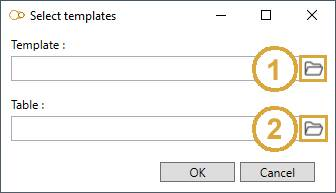
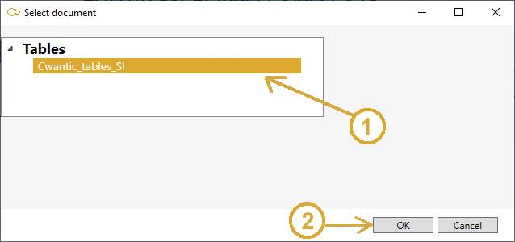

# Reporting

After designing the whole model, setting the loading, reviewing the data and analysing the study, click on the **REPORTING** button to generate a complete report.

> This explanation is available for MetaPiping and MetaStructure.

## 1. Templates

The first step is to define the **template** of the report and the **table** document that exposes the content and the properties of each **keywords**.

* Click on the **Import templates** button (1)

Select from the settings, the **template** document and the **table** document :

* Select a template document (1)
* Select a table document (2)

Click [here](https://documentation.metapiping.com/Settings/Reporting.html) to have more information about the reporting mechanism, the definition of a template and a table document.

The **select document window** (example for table) will appear :

* Select the document (1)
* Click OK (2)

* Click OK to validate

The **template** document is copied to the study directory (the original will stay unchanged) and can now be modified to adapt some content to current model.

* Click the **Edit template** (2) to modify the local document (in Microsoft Word)

{: .warning }
>ATTENTION, don't forget to save (not save as) your modifications.

## 2. Report

Once the **template** defined and adapted for the current model, it is time to generate the report.

* Fill the report name cell
* Click the **Generate report** button (3)

A progress bar will display the progress of generation. The screen will change depending on the **picture** instructions.

You can finally edit the resulting **report** :

* Click the **Edit report** button (4) to modify the final report (in Microsoft Word)

{: .warning }
>ATTENTION, don't forget to save (not save as) your modifications.

You can quit the study, the template and report are still in the directory.

{: .warning }
>ATTENTION, if you make any modification in the model, the loads or the analysis, you have to re-generate the report. It will restart from the  template document but the last manual modifications on the final report will be lost.
