# Piping review

## 1. Ribbon menu

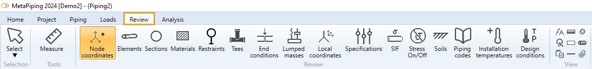

## 2. Data panel

A right panel can be opened by clicking on the top button. It presents the selected data :

>Click on the same button to hide the panel. Shortcut = F2.

>TIP : you can copy the data by CTRL+C and paste in other software.

## 3. Select tool

Click on the **Select** button to open the **Selection tool** :

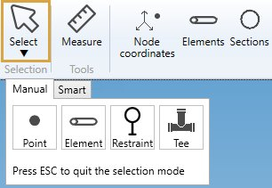

Click [here](https://documentation.metapiping.com/Design/Selection.html) for more information about the selection tool.

## 4. Measure tool

MetaPiping lets you measure the **distance** between 2 nodes :

1. Select the **Measure** tool
2. Select the first node
3. Select the second node with CTRL pressed
4. The distances appear on the left panel

You can continue to select other nodes (with CTRL pressed), only the 2 last ones will be taken in account.

| Property | Description | Unit Metric | Unit USA |
| -------- | ----------- | ---- | ---- |
| DX | Distance on global X | m | ft |
| DY | Distance on global Y | m | ft |
| DZ | Distance on global Z | m | ft |
| Distance | Distance between the 2 nodes | m | ft |

>The **Selection mode** is automatically set to POINT when clicking the **Measure** button.

## 5. Node coordinates

Click on the **Node coordinates** button :

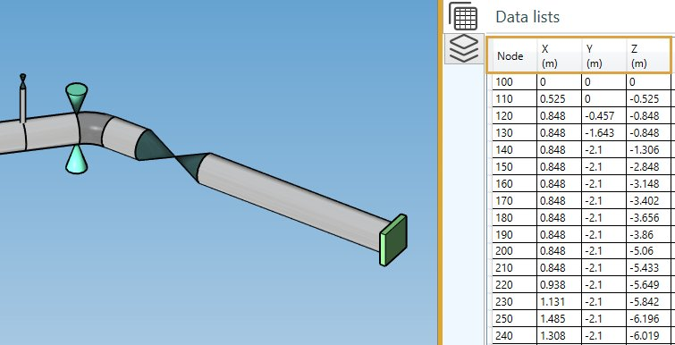

The **Data panel** shows the global coordinates X, Y, Z for each node.

| Property | Description | Unit Metric | Unit USA |
| -------- | ----------- | ---- | ---- |
| Node name | Text or number | - | - |
| X | X global coordinate | m | ft |
| Y | Y global coordinate  | m | ft |
| Z | Z global coordinate  | m | ft |

>The **Selection mode** is automatically set to POINT

**INTERACTIVITY** :

1. Select a node in the model (1) will highlight the corresponding row in the data list (2) :

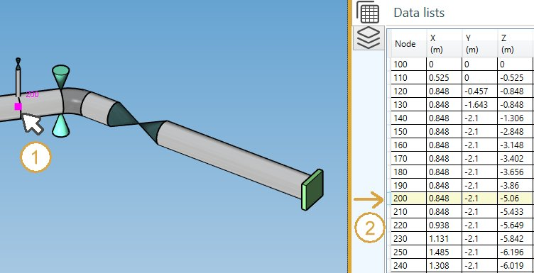

2. Select a row in the data list (1) will highlight the corresponding node in the model (2) :

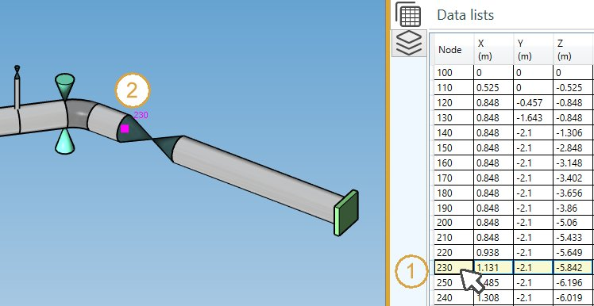

>The data are not editable

## 6. Elements

Click on the **Elements** button :

| Property | Unit Metric | Unit USA |
| -------- | ---- | ---- |
| Element type | - | - |
| Node1 name | - | - |
| Node2 name | - | - |
| DX | m | ft |
| DY | m | ft |
| DZ | m | ft |
| Length | m | ft |
| Diameter | mm | in |
| Thickness | mm | in |
| Operating density | - | - |
| Test density | - | - |

The **INTERACTIVITY** is the same as explained on §5.

>The data are not editable

## 7. Sections

Click on the **Sections** button :

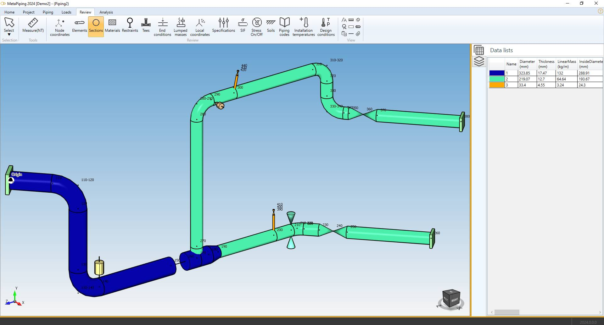

The piping elements are colorized in the color of their corresponding section.

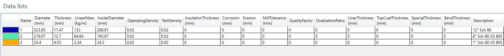

| Property | Unit Metric | Unit USA |
| -------- | ---- | ---- |
| Section color | - | - |
| Name | - | - |
| Diameter | mm | in |
| Thickness | mm | in |
| Linear mass | kg/m | lb/ft |
| Inside diameter | mm | in |
| Operating density | - | - |
| Test density | - | - |
| Insulation thickness | mm | in |
| Corrosion | mm | in |
| Erosion | mm | in |
| Mill tolerance | mm | in |
| Quality factor | - | - |
| Ovalization ratio | - | - |
| Liner thickness | mm | in |
| Topcoat thikness | mm | in |
| Special thickness | mm | in |
| Bend thickness | mm | in |
| Description | - | - |

>The data are not editable

## 8. Materials

Click on the **Materials** button :

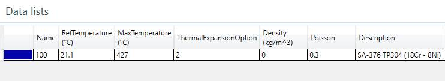

The piping elements are colorized in the color of their corresponding material.

| Property | Unit Metric | Unit USA |
| -------- | ---- | ---- |
| Material color | - | - |
| Name | - | - |
| Ref temperature | °C | °F |
| Max temperature | °C | °F |
| Thermal expansion option | - | - |
| Density | kg/m³ | lb/ft³ |
| Poisson | - | - |
| Description | - | - |

>The data are not editable

## 9. Restraints

Click on the **Restraints** button :

The **Data panel** shows the **Restraint type** and the **Level** for each restraint.

The **INTERACTIVITY** is the same as explained on §5.

>The data are not editable

## 10. Tees

Click on the **Tees** button :

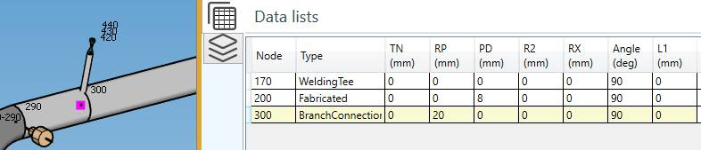

| Property | Description | Unit Metric | Unit USA |
| -------- | ---- | ---- | -- |
| TN | Branch connections and lateral connections reinforcement thickness | mm | in |
| RP | Branch Outer Radius | mm | in |
| PD | Pad thickness for reinforced fabricated tees | mm | in |
| R2 | Branch-to-run fillet radius | mm | in |
| RX | Transition radius | mm | in |
| Angle | Angle header/branch | ° | ° |
| L1 | Branch reinforcement length | mm | in |

The **INTERACTIVITY** is the same as explained on §5.

>The data are not editable

## 11. End conditions

Click on the **End conditions** button :

| Property |  Unit Metric | Unit USA |
| -------- |  ---- | -- |
| Color | - | - |
| Node name | - | - |
| Joint type | - | - |
| Mismatch | mm | in |
| Fillet length | mm | in |
| TMax | mm | in |

The **INTERACTIVITY** is the same as explained on §5.

>The data are not editable

## 12. Lumped masses

Click on the **Lumped masses** button :

| Property |  Unit Metric | Unit USA |
| -------- |  ---- | -- |
| Node name | - | - |
| Mass | ton | kips |
| Description | - | - |

Click [here](https://documentation.metapiping.com/Design/Elements/Node.html#5-creation-of-a-lumped-mass) for more information about creation of lumped mass on node.

The **INTERACTIVITY** is the same as explained on §5.

>The data are not editable

## 13. Local coordinates

Click on the **Local coordinates** button :

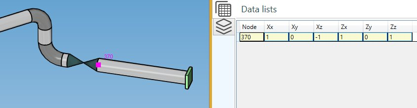

| Property | Unit Metric | Unit USA |
| -------- | ---- | ---- |
| Node name | - | - |
| Xx | - | - |
| Xy | - | - |
| Xz | - | - |
| Zx | - | - |
| Zy | - | - |
| Zz | - | - |

Click [here](https://documentation.metapiping.com/Design/Elements/Node.html#4-creation-of-a-local-coordinate-system) for more information about creation of local coordinates on node.

The **INTERACTIVITY** is the same as explained on §5.

>The data are not editable

## 14. Specifications

Click on the **Specifications** button :

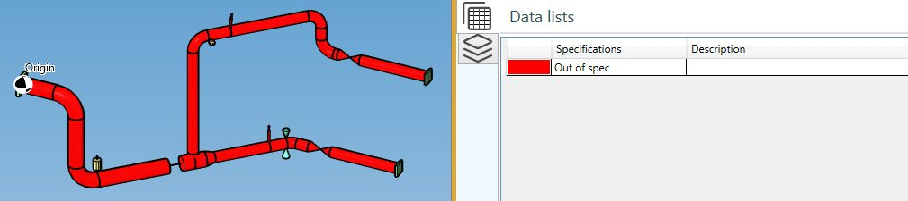

>The data are not editable

Click [here](https://documentation.metapiping.com/Settings/Specifications.html) for more information about creation of specification.

## 15. SIF

MetaPiping lets you define **Stress Intensification Factors** on nodes and elements.

Click on the **SIF** button :

| Property | Definition |
| -------- | --- |
| At Node name | The node where the SIF are defined |
| Af Node name | Empty if SIF on all elements (extremities) - otherwise only on the element (extremity) defined by the Af node |
| Body | Yes if SIF on element - Empty if SIF on node |

If Body = Yes, Node At and Node Af correspond to the nodes of the element

Click [here](https://documentation.metapiping.com/Design/Modification.html#5-node-sif) for more information about creation of Stress Intensification Factors on nodes and elements.

Each **piping code** has its own factors.

| Code | SIFS | 
| -------- | ----------- | 
| ASME Class 1 | B1, C1, K1, B2, C2, K2, C3, CP, K3 |
| ASME Class 2 | i, B1, B2, B2', C2 |
| B31.1 | i |
| B31.1 B31.J | ii, io, it, ia, Ii, Io, It, Ia |
| EN 13480 | io, ii |
| RCCM Class 2 | i |

The **INTERACTIVITY** is the same as explained on §5.

>The data are not editable

## 16. Stress On/Off

Click on the **Stress On/Off** button :

| Property | Definition |
| -------- | --- |
| Color | Red = stress reporting off - Green = stress reporting on |
| Element type | - |
| From | Element Node1 name |
| To | Element Node2 name |
| Stress off | Yes or empty |

Click [here](https://documentation.metapiping.com/Design/Modification.html#95-stress-onoff) for more information about Stress On/Off definition.

>The data are not editable

## 17. Soils

Click on the **Soils** button :

Click [here](https://documentation.metapiping.com/Design/Modification.html#94-soil) for more information about soil definition.

>The data are not editable

## 18. Piping codes

Click on the **Piping codes** button :

Click [here](https://documentation.metapiping.com/Design/Modification.html#93-piping-code) for more information about piping code definition.

>The data are not editable

## 19. Installation temperatures

Click on the **Installation temperatures** button :

| Property | Unit Metric | Unit USA |
| -------- | ---- | ---- |
| Color | - | - |
| Installation temperature | °C | °F |

Click [here](https://documentation.metapiping.com/Design/Modification.html#91-installation-temperature) for more information about installation temperature definition.

>The data are not editable

## 20. Design conditions

Click on the **Design conditions** button :

| Property | Unit Metric | Unit USA |
| -------- | ---- | ---- |
| Color | - | - |
| Design conditions (Temperature // Pressure) | °C  //  N/mm² | °F // lb/in² |

Click [here](https://documentation.metapiping.com/Design/Modification.html#92-design-conditions) for more information about design condition definition.

>The data are not editable

