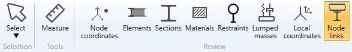
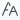

# Structure review

## 1. Ribbon menu

## 2. Data panel

A right panel can be opened by clicking on the top button. It presents the selected data :

>Click on the same button to hide the panel. Shortcut = F2.

>TIP : you can copy the data by CTRL+C and paste on other software.

## 3. Select tool

Click on the **Select** button to open the **Selection tool** :

Click [here](https://documentation.metapiping.com/Structure/Selection.html) for more information about the selection tool.

## 4. Measure tool

MetaStructure lets you measure the **distance** between 2 nodes :

1. Select the **Measure** tool
2. Select the first node
3. Select the second node with CTRL pressed
4. The distances appear on the left panel

You can continue to select other nodes (with CTRL pressed), only the 2 last ones will be taken in account.

| Property | Description | Unit Metric | Unit USA |
| -------- | ----------- | ---- | ---- |
| DX | Distance on global X | m | ft |
| DY | Distance on global Y | m | ft |
| DZ | Distance on global Z | m | ft |
| Distance | Distance between the 2 nodes | m | ft |

>The **Selection mode** is automatically set to POINT when clicking the **Measure** button.

## 5. Node coordinates

Click on the **Node coordinates** button :

The **Data panel** shows the global coordinates X, Y, Z for each node.

| Property | Description | Unit Metric | Unit USA |
| -------- | ----------- | ---- | ---- |
| Node name | Text or number | - | - |
| X | X global coordinate | m | ft |
| Y | Y global coordinate  | m | ft |
| Z | Z global coordinate  | m | ft |

>The **Selection mode** is automatically set to POINT

**INTERACTIVITY** :

1. Select a node on the model (1) will highlight the corresponding row on the data list (2) :

2. Select a row on the data list (1) will highlight the corresponding node on the model (2) :

>The data are not editable

3. Hold down the left mouse button to make a rectangular selection :

Release the mouse button, the data are highlighted :

## 6. Elements

Click on the **Elements** button :

| Property | Unit Metric | Unit USA |
| -------- | ---- | ---- |
| Element type | - | - |
| Node1 name | - | - |
| Node2 name | - | - |
| DX | m | ft |
| DY | m | ft |
| DZ | m | ft |
| Length | m | ft |
| Section | - | - |

The **INTERACTIVITY** is the same as explained on §5.

>The data are not editable

## 7. Sections

Click on the **Sections** button :

The beam elements are colorized in the color of their corresponding section.

| Property | Description | Unit Metric | Unit USA |
| -------- | ---- | ---- | ---- |
| Section color | - | - | - |
| Name | Section's name | - | - |
| Description | Section's description | - | - |
| h | Height | mm | in |
| b | Basis | mm | in |
| tw | Web thickness | mm | in |
| tf | Flange thickness | mm | in |
| Ix | Bending inertia X | cm^4 | in^4 |
| Iy | Bending inertia Y | cm^4 | in^4 |
| It | Torsional inertia | cm^4 | in^4 |
| A | Area | cm² | in² |
| Ax | Shear area X | cm² | in² |
| Ay | Shear area Y | cm² | in² |

>The data are not editable

Other properties can be found on the **Data** screen. Click [here](https://documentation.metapiping.com/Structure/Specification/Data.html#12-beam-definition) for more information.

## 8. Materials

Click on the **Materials** button :

The elements are colorized in the color of their corresponding material.

| Property | Unit Metric | Unit USA |
| -------- | ---- | ---- |
| Material color | - | - |
| Name | - | - |
| Ref temperature | °C | °F |
| Max temperature | °C | °F |
| Thermal expansion option | - | - |
| Density | kg/m³ | lb/ft³ |
| Poisson | - | - |
| Description | - | - |

>The data are not editable

## 9. Restraints

Click on the **Restraints** button :

The **Data panel** shows the **Restraint type** and the **Level** for each restraint.

The **INTERACTIVITY** is the same as explained on §5.

>The data are not editable

Click [here](https://documentation.metapiping.com/Loads/Structure/Spectra.html#4-restraints) for more informations about **Level** during **Spectra** definition.

## 10. Lumped masses

Click on the **Lumped masses** button :

| Property |  Unit Metric | Unit USA |
| -------- |  ---- | -- |
| Node name | - | - |
| Mass | ton | kips |
| Description | - | - |

Click [here](https://documentation.metapiping.com/Structure/Elements/Node.html#5-creation-of-a-lumped-mass) for more information about creation of lumped mass on node.

The **INTERACTIVITY** is the same as explained on §5.

>The data are not editable

## 11. Local coordinates

It is useful to define a new coordinate system especially if we need to orient an **Anchor plate** on a node.

Click on the **Local coordinates** button :

| Property | Unit Metric | Unit USA |
| -------- | ---- | ---- |
| Node name | - | - |
| Xx | - | - |
| Xy | - | - |
| Xz | - | - |
| Zx | - | - |
| Zy | - | - |
| Zz | - | - |

Click [here](https://documentation.metapiping.com/Structure/Elements/Node.html#4-creation-of-a-local-coordinate-system) for more information about creation a new coordinate system on node.

The **INTERACTIVITY** is the same as explained on §5.

>The data are not editable

## 12. Node links

This tool creates a Link between one piping node and multiple structure nodes.

    This link is necessary for load definition (External load) and during analysis.

Click on the **Node links** button :

| Property | Description |
| -------- | ---- |
| Color | - |
| Node 1 | First **structure** node of the link |
| Node 2 | Second **structure** node of the link |
| Node 3 | Third **structure** node of the link |
| Node 4 | Fourth **structure** node of the link |
| Static friction | Static friction factor |
| Dynamic friction | Dynamic friction factor |
| Study | Name of the linked piping **study** |
| Piping node | Name of the linked piping **node** |

>The data are not editable

Click [here](https://documentation.metapiping.com/Structure/Elements/Link.html) for more information about **links**.

### 13. View options

 show/hide the node name

 show/hide the node point

 copy the 3D view to the clipboard

 show the structure in shaded mode

 show the structure in hidden lines mode

 show the structure in wireframe mode

 show/hide the shadows

 shows/hides the silhouette drawing

 shows/hides the linked study models 
