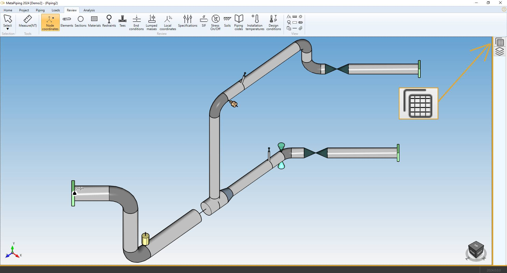
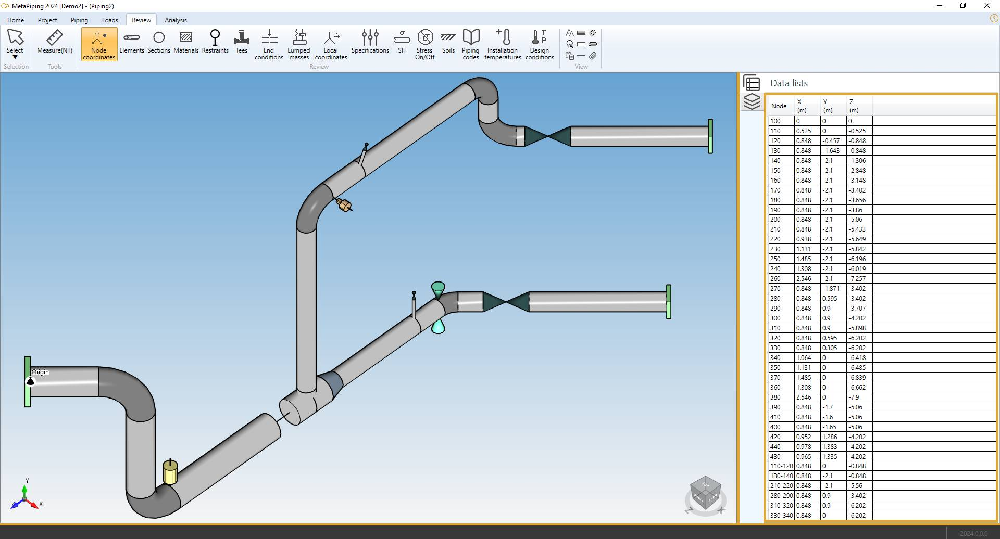
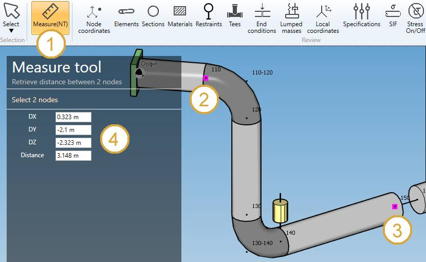

# Review

The **REVIEW** ribbbon tab let you verify all data of the model.

## 1. Ribbon menu

## 2. Data panel

A right panel can be opened by clicking on the top button. It presents the selected data :

>Click on the same button to hide the panel. Shortcut = F2.

>TIP : you can copy the data by CTRL+C and paste on other softwares.

## 3. Select tool

Click on the **Select** button to open the **Selection tool** :

Click [here](https://documentation.metapiping.com/Design/Selection.html) for more information about the selection tool.

## 4. Measure tool

MetaPiping let you measure the **distance** between 2 nodes :

1. Select the **POINT** selection mode
2. Select the first node
3. Select the second node
4. Click on the **Measure** button

A window shows the projected distance in global X, Y, Z and the distance between the 2 nodes.

| Property | Description | Unit Metric | Unit USA |
| -------- | ----------- | ---- | ---- |
| DX | Distance on global X | m | ft |
| DY | Distance on global Y | m | ft |
| DZ | Distance on global Z | m | ft |
| D | Distance between the 2 nodes | m | ft |

## 5. Node coordinates

Click on the **Node coordinates** button :

The **Data panel** shows the global coordinates X, Y, Z for each node.

| Property | Description | Unit Metric | Unit USA |
| -------- | ----------- | ---- | ---- |
| Node name | Text or number | - | - |
| X | X global coordinate | m | ft |
| Y | Y global coordinate  | m | ft |
| Z | Z global coordinate  | m | ft |

>The **Selection mode** is automatically set to POINT

**INTERACTIVITY** :

1. Select a node on the model (1) will highlight the corresponding row on the data list (2) :

2. Select a row on the data list (1) will highlight the corresponding node on the model (2) :

>The data are not editable

## 6. Elements

Click on the **Elements** button :

| Property | Unit Metric | Unit USA |
| -------- | ---- | ---- |
| Element type | - | - |
| Node1 name | - | - |
| Node2 name | - | - |
| DX | m | ft |
| DY | m | ft |
| DZ | m | ft |
| Length | m | ft |
| Diameter | mm | in |
| Thickness | mm | in |
| Operating density | kg/m³ | lb/ft³ |
| Test density | kg/m³ | lb/ft³ |

The **INTERACTIVITY** is the same as explained on §5.

>The data are not editable

## 7. Sections

Click on the **Sections** button :

The piping elements are colorized in there corresponding section's color.

| Property | Unit Metric | Unit USA |
| -------- | ---- | ---- |
| Section color | - | - |
| Diameter | mm | in |
| Thickness | mm | in |
| Description | - | - |

>The data are not editable

## 8. Materials

Click on the **Materials** button :

The piping elements are colorized in there corresponding material's color.

>The data are not editable

## 9. Restraints

Click on the **Restraints** button :

The **Data panel** shows the **Restraint type** and the **Level** for each node.

The **INTERACTIVITY** is the same as explained on §5.

>The data are not editable

## 10. Tees

Click on the **Tees** button :

| Property | Description | Unit Metric | Unit USA |
| -------- | ---- | ---- | -- |
| TN | Branch connections and piping lateral connections CONSTANT thickness | mm | in |
| RP | Branch Outer Radius | mm | in |
| PD | Pad thickness for reinforced fabricated tees | mm | in |
| R2 | Branch-to-run fillet radius | mm | in |
| RX | Transition radius | mm | in |
| Angle | Angle collector/branch | ° | ° |

The **INTERACTIVITY** is the same as explained on §5.

>The data are not editable

## 11. End conditions

Click on the **End conditions** button :

| Property |  Unit Metric | Unit USA |
| -------- |  ---- | -- |
| Color | - | - |
| Node name | - | - |
| Joint type | - | - |
| Mismatch | mm | in |
| Fillet | mm | in |
| TMax | mm | in |

The **INTERACTIVITY** is the same as explained on §5.

>The data are not editable

## 12. Lumped masses

Click on the **Lumped masses** button :

| Property |  Unit Metric | Unit USA |
| -------- |  ---- | -- |
| Node name | - | - |
| Mass | ton | kips |
| Description | - | - |

Click [here](https://documentation.metapiping.com/Design/Elements/Node.html#5-creation-of-a-lumped-mass) for more information about creation of lumped mass on node.

The **INTERACTIVITY** is the same as explained on §5.

>The data are not editable

## 13. Local coordinates

Click on the **Local coordinates** button :

| Property | Unit Metric | Unit USA |
| -------- | ---- | ---- |
| Node name | - | - |
| Xx | m | ft |
| Xy | m | ft |
| Xz | m | ft |
| Zx | m | ft |
| Zy | m | ft |
| Zz | m | ft |

Click [here](https://documentation.metapiping.com/Design/Elements/Node.html#4-creation-of-a-local-coordinate-system) for more information about creation of local coordinates on node.

The **INTERACTIVITY** is the same as explained on §5.

>The data are not editable

## 14. Specifications

Click on the **Specifications** button :

>The data are not editable

Click [here](https://documentation.metapiping.com/Settings/Specifications.html) for more information about creation of specification.

## 15. SIF

MetaPiping let you define **Stress Intensification Factors** on nodes and elements.

Click on the **SIF** button :

| Property | Definition |
| -------- | --- |
| At Node name | The node where the SIF are defined |
| Af Node name | Empty if SIF on all elements (extremities) - otherwise only on the element (extremity) defined by the Af node |
| Body | Yes if SIF on element - Empty if SIF on node|

If Body = Yes, Node At and Node Af correspond to the nodes of the element

Click [here](https://documentation.metapiping.com/Design/Modification.html#5-node-sif) for more information about creation of Stress Intensification Factors on nodes and elements.

Each **piping code** has its own factors.

| Code | SIFS | 
| -------- | ----------- | 
| ASME Class 1 | B1, C1, K1, B2, C2, K2, C3, CP, K3 |
| ASME Class 2 | i, B1, B2, B2', C2 |
| B31.1 | i |
| B31.1 B31.J | ii, io, it, ia, Ii, Io, It, Ia |
| EN 13480 | io, ii |
| RCCM Class 2 | i |

The **INTERACTIVITY** is the same as explained on §5.

>The data are not editable

## 16. Stress On/Off

Click on the **Stress On/Off** button :

| Property | Definition |
| -------- | --- |
| Color | Red = stress reporting off - Green = stress reporting on |
| Element type | - |
| From | Element's Node1 name |
| To | Element's Node2 name |
| Stress off | Yes or empty |

Click [here](https://documentation.metapiping.com/Design/Modification.html#7-stress-on/off) for more information about Stress On/Off definition.

>The data are not editable