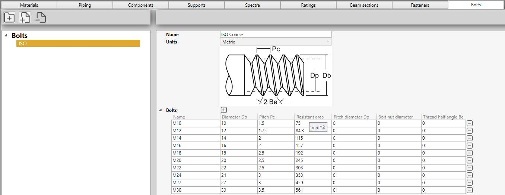

# Bolts

In this section, bolt library can be created.

A bolt library is a **JSON** file with a name, units and a list of bolts.

## 1. Organisation

On the left panel, you can create folders, sub-folders and bolt libraries.

The **-** button is used both for removing folders and libraries.

You can drag a file/folder on another folder.

    To know the UNIT of a property, just let the mouse over the property name. 
    For example : mm^2 for the Resistant area

## 2. Bolt

Click the **+** button (next to Bolts) to add a new bolt or click the **-** button (at the end of a row) to remove one.

Properties :

| Property | Description | Unit Metric | Unit USA |
| -------- | ----------- | ---- | ---- |
| Name | The name of the bolt | - | - |
| Diameter | Outside diameter | mm | in |
| Pitch | Distance between threads | mm | in |
| Resistant area | Tensile stress area | mm² | in² |

## 3. Bolting plate

The Bolt library can be called during bolting plate definition.
