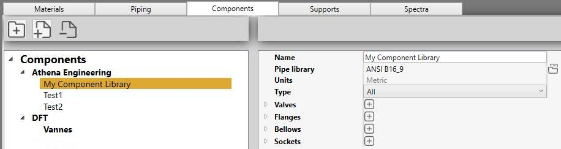
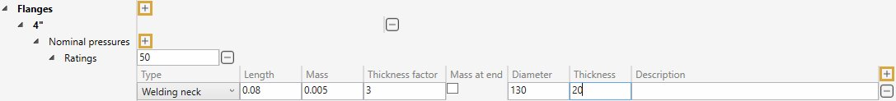

# Components

In this section, libraries of components can be created. 

A library is a **JSON** file with a name, a reference to a piping library and a list of components.

Components are :

- Valves
- Flanges
- Bellows
- Sockets

## 1. Organisation

On the left panel, you can create folders, sub-folders and libraries.

The **-** button is used both for removing folders and libraries.

A folder can be a type of component or a specific provider.

You can also drag a file/folder on another folder.

## 2. Library

A library can be managed as you want.

It can correspond to a provider of several component (Ex : flanges, bellows and sockets) or be specific to a product (Ex : only valves).

A library is referenced to an existing [Piping library](https://documentation.metapiping.com/Settings/Databases/Piping.html) for the size definitions. Units are then imposed.

### 2.1 Valves

Click the **+** button to add valves for a specific pipe size. Select a size (Ex : 4") :

For this size, create several **Ratings** (max service pressure). It is a text and is just informative (Ex : 50).

Click the **+** button to add a new valve of a certain type :

- Simple
- With middle point
- With excentricity

| Property | Unit Metric | Unit USA | 
| -------- | ---- | ---- | 
| Length | m | ft |
| Mass | ton | kips | 
| Thickness factor | - | - | 

    The wall thickness is increased by the thickness factor by equally increasing the outer diameter and decreasing the inner diameter, keeping the mean diameter the same as that of connected pipe. The thickness value is reduced if the wall thickness is too great. Default = 3.

The connection indicates how the valve is connected to the pipes :

- None
- Butt weld - flush
- Butt weld - as welded
- Fillet weld
- Full fillet weld
- Threaded
- Brazed

### 2.2 Flanges

Click the **+** button to add flanges for a specific pipe size. Select a size (Ex : 4") :

For this size, create several **Ratings** (max service pressure). It is a text and is just informative (Ex : 50).

Click the **+** button to add a new flange of a certain type :

- Welding neck
- Slip-on
- Lap joint
- Threaded
- Socket welding
- Blind

| Property | Unit Metric | Unit USA |
| -------- | ---- | ---- |
| Length | m | ft |
| Mass | ton | kips |
| Thickness factor | - | - |
| Diameter of the flange| mm | in |
| Thickness of the flange | mm | in |

    The wall thickness is increased by the thickness factor by equally increasing the outer diameter and decreasing the inner diameter, keeping the mean diameter the same as that of connected pipe. The thickness value is reduced if the wall thickness is too great. Default = 3.

### 2.3 Bellows

Click the **+** button to add bellows for a specific pipe size. Select a size (Ex : 4") :

For this size, create several **Ratings** (max service pressure). It is a text and is just informative (Ex : 50).

Click the **+** button to add a new bellow of a certain type :

- Axial : *Axial and lateral displacements and rotations are permitted*
- Lateral in a single plane : *Lateral displacements are only permitted in the plane defined by the local axes Z’ and X’. No axial displacements nor rotations are permitted*
- Lateral in all planes : *Lateral displacements are permitted in all directions perpendicular to the element axis Z’. No axial displacements nor rotations are permitted*
- Angular in a single plane : *Rotations are only permitted about the local axis Y’. The movements are thus restricted to the plane defined by the local axes Z’ and X’*
- Angular in all planes : *Rotations are permitted about all axes perpendicular to Z’*

| Property | Unit Metric | Unit USA |
| -------- | ---- | ---- |
| Length | m | ft |
| Distributed mass | ton | kips |
| Pressure area | mm² | in² |
| Axial stiffness| kN/mm | kips/in |
| Lateral stiffness | kN/mm | kips/in |
| Angular stiffness | kN.m/rad | kips.ft/rad |
| Torsional stiffness | kN.m/rad | kips.ft/rad |

    If Torsional stiffness is zero or blank, the joint is modeled as rigid in torsion and the user should verify that the moments about the element axis Z’ are acceptable.

    One half of the mass will be concentrated at each end of the bellow.

### 2.4 Sockets

Click the **+** button to add sockets for a specific pipe size. Select a size (Ex : 4") :

For this size, create several **Ratings** (max service pressure). It is a text and is just informative (Ex : 50).

Click the **+** button to add a new socket.

| Property | Unit Metric | Unit USA | 
| -------- | ---- | ---- | 
| Length | m | ft |
| Mass | ton | kips | 
| Thickness factor | - | - | 

    The wall thickness is increased by the thickness factor by equally increasing the outer diameter and decreasing the inner diameter, keeping the mean diameter the same as that of connected pipe. The thickness value is reduced if the wall thickness is too great. Default = 3.
