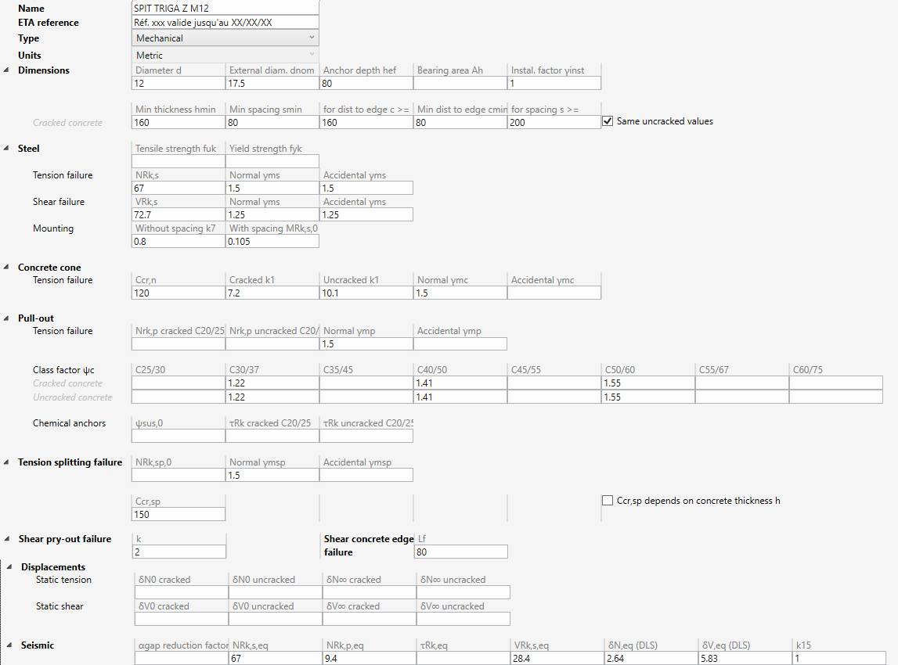

# Fasteners

In this section, fasteners can be created.

A fastener is a **JSON** file with a name, a type, units and a list of properties.

## 1. Organization

On the left panel, you can create folders, sub-folders and fasteners.

The **-** button is used both for removing folders and fasteners.

You can also import fasteners from BEAMSTRESS.

You can drag a file/folder on another folder.

## 2. Fastener

The fastener characteristics are defined by means of properties normally given in the ETA's (European Technical Assessments) provided by the manufacturer. The notations are those of code EN 1992-4 edition 2018 :

You can impose a constant stiffness or leave the box empty to let the application determine it.

The ultimate tensile strength fuk and yield strength fyk allow to calculate the partial safety factors for the steel. If not available, the user must enter these safety factors directly.

The resistance to pull-out Nrk,p must be defined for non-bonded fasteners. For bonded fasteners, the strength is calculated based on the parameters provided for chemical anchors.

For some fasteners, the characteristic distance Ccr,sp (splitting failure) depends on the concrete  thickness :

In this case, check the box **Ccr,sp depends on concrete thickness** and enter the ratio Ccr,sp/hef for two values of the ratio h/hef (beginning with the smallest value of h/hef), where h is the concrete thickness.

The parameters δN0, δNꚙ, δV0 and δVꚙ are flexibilities (in mm/kN or in/kips). MetaStructure multiplies these values by the tensile and shear forces on the fasteners to obtain the resulting displacements. Two sets of values are given by the manufactures: short-term loadings (index 0) and long-term loadings (index ꚙ). MetaStructure will calculate the displacements for these two durations.

    To know the UNIT of a property, just let the mouse over the property name. 

## 3. Plate anchors

The fastener library can be called during anchor plate definition.
