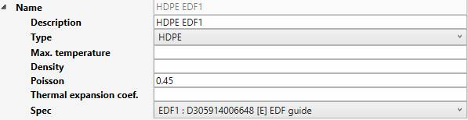

# Materials

In this section, libraries of materials can be created. 

A library is a **JSON** file with a name, a target, units, a reference temperature and a list of materials.

Target can be :
  
* Piping
* Structure
* Bolting
* Welding

Click the **+ Folder** button to add a new folder, click the **+ File** to add a new library or click the **-** button to remove the selected folder or an **unused** library (not defined in a specification).

You can also import materials from BEAMSTRESS.

You can also drag a file/folder on another folder.

*Example : "ASME II Part D 2008"*

    To know the UNIT of a property, just let the mouse over the property name. 
    For example : °C for the Ref. temperature

Click on **+** button (next to Materials) to add a new material or click on **-** button (next to Name) to remove one.

Define the description, type, thermal expansion option, max temperature, density and Poisson's ratio.

Click on **+** button (next to Properties) to add a new row of properties for a **given temperature** or click on **-** button (end of row) to remove one.

| Property | Description | Unit Metric | Unit USA |
| -------- | ----------- | ---- | ---- |
| Max. temperature | Max temperature | °C | °F |
| Density | Density | kg/m³ | lb/ft³ |
| Poisson | Poisson's ratio | - | - |
| EH | Modulus of Elasticity | kN/mm² | 10^6.psi |
| EX | Thermal Expansion | 10^-6.mm/mm/°C | 10^-6.in/in/°F |
| SH | Non-Class 1 Allowable Stress | N/mm² | ksi |
| SY | Yield Stress | N/mm² | ksi |
| SU | Ultimate Tensile Stress | N/mm² | ksi |
| SM | Class 1 Allowable Stress | N/mm² | ksi |
| CR | Creep | N/mm² | ksi |
| GH | Shear Modulus | kN/mm² | 10^6.psi |
| CO | Class 1 Thermal Conductivity | kJ/hr/m/°C | btu/hr/ft/°F |
| DI | Class 1 Thermal Diffusivity | mm²/s | ft²/hr |
| E2 | Modulus of Elasticity 2 | kN/mm² | 10^6.psi |

See [Units](https://documentation.metapiping.com/Design/units.html) for more informations.

{: .warning }
>ATTENTION, temperatures must be entered in ascending order!

**HDPE MATERIALS** :

The HDPE materials have simpler properties :

| Property | Description | Unit Metric | Unit USA |
| -------- | ----------- | ---- | ---- |
| Max. temperature | Temperature max | °C | °F |
| Density | Density | kg/m³ | lb/ft³ |
| Poisson | Poisson's ratio | - | - |
| Thermal expansion coef. | Thermal Expansion | 10^-6.mm/mm/°C | 10^-6.in/in/°F |
| Spec | Spec value (see below) | - | - |

Spec values :

* ISO : EN 15494:2015 with coefficient = 1.25
* ASTM : ASTM with factor = 0.63
* ASME :  ASTM with factor = 0.5
* EDF1 : D305914006648 [E] EDF guide
* EDF2 : D305921021240 [A] EDF guide
* EDF3 : D305921021240 [B] EDF guide

All other properties for the calculation are automatically set.
