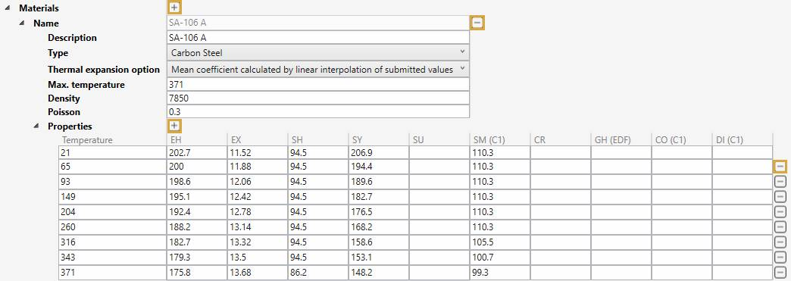

# Materials

In this section, libraries of materials can be created. 

A library is a **JSON** file with a name, units, a reference temperature and a list of materials.

Click the **+** button to add a new library or click the **-** button to remove an **unused** library (not defined in a specification).

Example : "My Material Library"

    To know the UNIT of a property, just let the mouse over the property name. 
    For example : °C for the Ref. temperature

Click the **+** button (next to Materials) to add a new material or click the **-** button (next to Name) to remove one.

Define a description, the type, the temperature max, the density and the Poisson's ratio.

Click the **+** button (next to Properties) to add a new row of properties for a **specific temperature** or click the **-** button (end of row) to remove one.

| Property | Description | Unit Metric | Unit USA | 
| -------- | ----------- | ---- | ---- | 
| Max. temperature | Temperature max | °C | °F | 
| Density | Density | kg/m³ | lb/ft³ |
| Poisson | Poisson's ratio | - | - | 
| EH | Modulus of Elasticity | kN/mm² | 10^6.psi | 
| EX | Thermal Expansion | 10^-6.mm/mm/°C | 10^-6.in/in/°F | 
| SH | Non-Class 1 Allowable Stress | N/mm² | ksi | 
| SY | Yield Stress | N/mm² | ksi | 
| SU | Ultimate Tensile Stress | N/mm² | ksi | 
| SM | Class 1 Allowable Stress | N/mm² | ksi | 
| CR | Creep | N/mm² | ksi | 
| GH | Shear Modulus | kN/mm² | 10^6.psi | 
| CO | Class 1 Thermal Conductivity | kJ/hr/m/°C | btu/hr/ft/°F | 
| DI | Class 1 Thermal Diffusivity | mm²/s | ft²/hr | 

See [Units](https://documentation.metapiping.com/Design/units.html) for more informations.

>ATTENTION, temperatures must be entered in ascending order!
