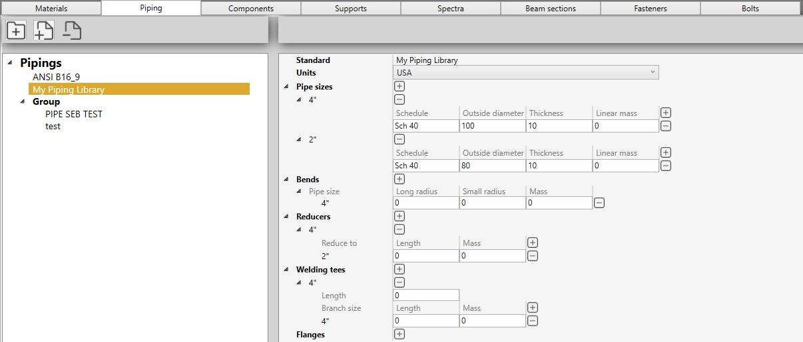

# Piping

In this section, piping libraries can be created. 

A library is a **JSON** file with a name, units and a list of pipe sizes, bend, reducer, welding tee and flange definitions.

Click the **+ Folder** button to add a new folder, click the **+ File** to add a new library or click the **-** button to remove a folder or an **unused** library (not defined in a specification).

You can also drag a file/folder on another folder.

*Example : "My Piping Library"*

## 1. Pipe sizes

To add new pipe sizes, click on **+** button and give it a name (Ex : 4") :

Each size exists in different schedules. Click on **+** button to add schedules :

| Property | Unit Metric | Unit USA | 
| -------- | ---- | ---- | 
| Schedule | - | - | 
| Outside diameter | mm | in |
| Thickness | mm | in | 
| Linear mass | kg/m | lb/ft | 

    To know the UNIT of a property, just let the mouse over the property name. 
    For example : mm for the Outside diameter

{: .warning }
>ATTENTION, the name of the pipe size is very important (Ex : 4"). It will be used as a **reference** for all other piping elements.

{: .warning }
>ATTENTION, the sizes must be defined in an **ascending** order.

## 2. Bends

To add **bend** properties for each pipe size, click on **+** button and select a pipe size :

Standard radius and mass can be entered :

| Property | Unit Metric | Unit USA | 
| -------- | ---- | ---- | 
| Long radius | m | ft | 
| Small radius | m | ft |
| Mass | ton | kips | 

{: .warning }
>ATTENTION, for a better readability, we recommend to enter the sizes in **ascending** order. 

## 3. Reducers

To add **reducer** properties for each pipe size, click on **+** button and select a pipe size :

Click on **+** button (next to Mass) to add all possible reduction from the current size to a **smaller** one.

Length and mass can be entered :

| Property | Unit Metric | Unit USA | 
| -------- | ---- | ---- | 
| Length | m | ft | 
| Mass | ton | kips | 

{: .warning }
>ATTENTION, for a better readability, we recommend to enter the sizes in **ascending** order. 

## 4. Welding tees

Welding tee is a special fitting with a header and a branch.

The section of the branch must be equal or smaller than the section of the header pipe.

To add **welding tee** properties for each pipe size, click on **+** button and select a pipe size :

{: .warning }
>ATTENTION, for a better readability, we recommend to enter the sizes in **ascending** order.

| Property | Unit Metric | Unit USA | 
| -------- | ---- | ---- | 
| Length | m | ft | 

The length corresponds to half the length of the header (L1 in the picture) :

Click on **+** button (next to Mass) to add all possible branch sizes from the current size to a **smaller** one.

Length and mass can be entered :

| Property | Unit Metric | Unit USA | 
| -------- | ---- | ---- | 
| Length of the branch L2 | m | ft | 
| Mass | ton | kips | 

## 5. Flanges

To add **flange** properties for each pipe sizes, click on **+** button and select a pipe size :

{: .warning }
>ATTENTION, for a better readability, we recommend to enter the sizes in **ascending** order.

For this size, create several **Ratings** (max service pressure). It is a text and is just informative (Ex : 50).

Click the **+** button (next to Mass) to add a new flange of a certain type :

- Welding neck
- Slip-on
- Lap joint
- Threaded
- Socket welding
- Blind

Length and mass can be entered :

| Property | Unit Metric | Unit USA |
| -------- | ---- | ---- |
| Length of the flange | m | ft |
| Mass | ton | kips |
