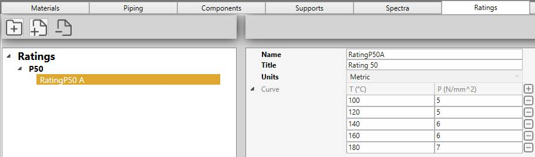

# Ratings

In this section, rating library can be created. 

A rating library is a **JSON** file with a name, units and a list of temperature/pressure curves.

## 1. Organisation

On the left panel, you can create folders, sub-folders and rating libraries.

The **-** button is used both for removing folders and libraries.

You can drag a file/folder on another folder.

## 2. Rating

Click the **+** button (next to Curve) to add a new temperature/pressure pair or click the **-** button (at the end of a row) to remove one.

## 3. Supports/Flanges post-processing

These libraries are only used during **Supports/Flanges post-processing**.

Click [here](https://documentation.metapiping.com/Explorer/Study.html#38-post-processing--supports--flanges) for more informations.
