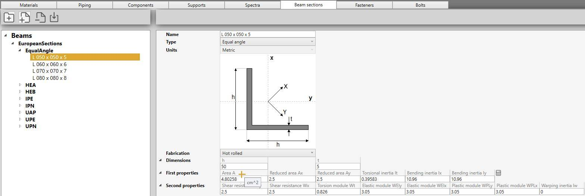

# Beam sections

In this section, beam section can be created.

A section is a **JSON** file with a name, a type, units and a list of geometrical properties.

## 1. Organisation

On the left panel, you can create folders, sub-folders and sections.

The **-** button is used both for removing folders and sections.

You can also import sections from BEAMSTRESS.

You can drag a file/folder on another folder.

    To know the UNIT of a property, just let the mouse over the property name. 
    For example : cm^2 for the Area A

## 2. Section

The type can be :

* Non standard
* I
* Channel
* Rect
* Tee
* Equal angle
* Unequal angle
* Round
* Plate

The preview image of the section and the properties vary with the type.

Properties :

| Property | Description | Unit Metric | Unit USA |
| -------- | ----------- | ---- | ---- |
| Fabrication | Hot rolled, cold rolled or welded | - | - |
| h | Height | mm | in |
| b | Basis | mm | in |
| tw | Web thickness | mm | in |
| tf | Flange thickness | mm | in |
| t | Thickness | mm | in |
| y0 | Shear center Y | mm | in |
| x0 | Shear center X | mm | in |
| A | Area | cm² | in² |
| Ax | Reduced area X | cm² | in² |
| Ay | Reduced area Y | cm² | in² |
| It | Torsional inertia | cm^4 | in^4 |
| Ix | Bending inertia X | cm^4 | in^4 |
| Iy | Bending inertia Y | cm^4 | in^4 |
| Wy | Shear resistance Y | cm² | in² |
| Wx | Shear resistance X | cm² | in² |
| Wt | Torsion module | cm^3 | in^3 |
| WEly | Elastic module Y | cm^3 | in^3 |
| WElx | Elastic module X | cm^3 | in^3 |
| WPLy | Plastic module Y | cm^3 | in^3 |
| WPLx | Plastic module X | cm^3 | in^3 |
| Iw | Warping inertia | cm^6 | in^6 |
