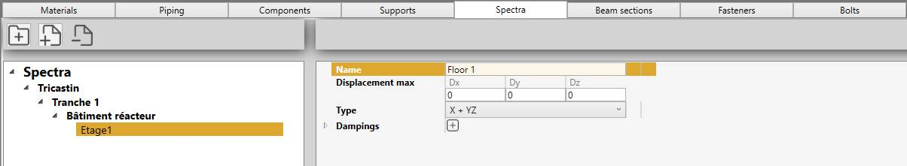
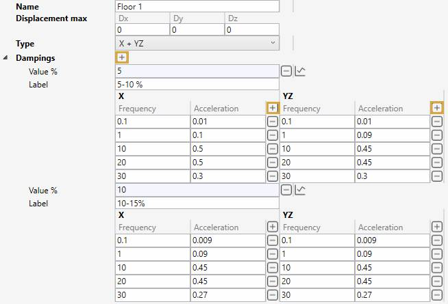

# Spectra

In this section, spectra can be created.

A spectrum is a **JSON** file with a name, a displacement max, a directional type and a list of dampings.

## 1. Organisation

On the left panel, you can create folders, sub-folders and spectra.

The **-** button is used both for removing folders and spectra.

A folder can be a site, a phase, a location or a floor for several spectrum files.

You can also drag a file/folder on another folder.

## 2. Spectrum

A spectrum defines the **curves** frequency/acceleration for different directions. And that for several dampings.

An *informative* dispacement max can be entered :

| Properties | Unit Metric | Unit USA |
| -------- | ---- | ---- |
| Dx, Dy, Dz | mm | in |

The **type** that defines the curves can be :

| Property | Nb curves | Note |
| -------- | ---- | --- |
| X + Y + Z | 3 | One curve by direction | 
| X + YZ | 2 | One curve for X and one curve for both Y and Z | 
| Y + XZ | 2 | One curve for Y and one curve for both X and Z | 
| Z + XY | 2 | One curve for Z and one curve for both X and Y | 
| XYZ | 1 | One curve for all directions | 

Based on this type, 1, 2 or 3 tables must be filled.

Click the **+** button (next to Dampings) to add a damping value (%) and a label :

Fill the tables by adding rows for the pair frequency/acceleration.

| Property | Unit |
| -------- | ---- | 
| Frequency | Hz | 
| Acceleration | G's | 

{: .warning }
>ATTENTION, the frequencies must be filled in ascending order

    Each table can have its own number of rows

You can also verify the tables of a damping by clicking on the last button next to Value % :

