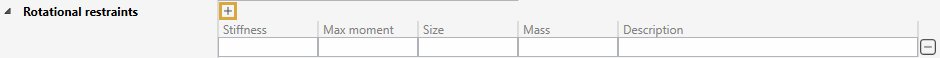
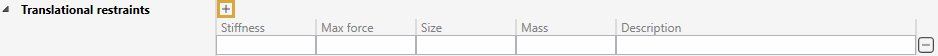
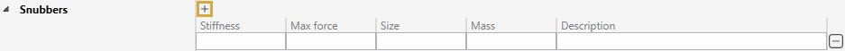
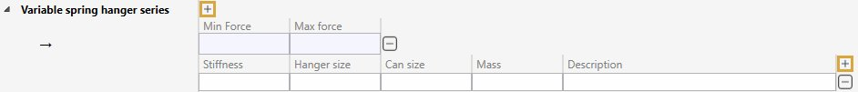
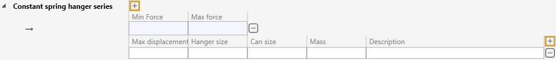

# Supports

In this section, libraries of components can be created. 

A library is a **JSON** file with a name, a unit and a list of supports.

Predefined support are :

- Rotational restraints
- Translational restraints
- Snubbers
- Variable spring hangers
- Constant spring hangers

## 1. Organisation

On the left panel, you can create folders, sub-folders and libraries.

The **-** button is used both for removing folders and libraries.

A folder can be a type of component or a specific provider.

## 2. Library

A library can be managed as you want. One library for all type of support or one provider of a specific type.

For all type, the main property is the **stiffness**. All other properties are essentially informative.

### 2.1 Rotational restraints

Click the **+** button to add a new support :

| Property | Unit Metric | Unit USA | Note |
| -------- | ---- | ---- | --- |
| Stiffness | kN.m/rad | kips.ft/rad | |
| Max moment | kN.m | kips.ft | informative |
| Size | mm | in | informative |
| Mass | ton | kips | informative |

### 2.2 Translational restraints

Click the **+** button to add a new support :

| Property | Unit Metric | Unit USA | Note |
| -------- | ---- | ---- | --- |
| Stiffness | kN/mm | kips/in | |
| Max force | kN | kips | informative |
| Size | mm | in | informative |
| Mass | ton | kips | informative |

### 2.3 Snubbers

Click the **+** button to add a new support :

| Property | Unit Metric | Unit USA | Note |
| -------- | ---- | ---- | --- |
| Stiffness | kN/mm | kips/in | |
| Max force | kN | kips | informative |
| Size | mm | in | informative |
| Mass | ton | kips | informative |

### 2.4 Variable spring hangers

Click the **+** button to add a new range of forces :

| Property | Unit Metric | Unit USA | Note |
| -------- | ---- | ---- | --- |
| Min force | kN | kips | informative |
| Max force | kN | kips | informative |

Click the **+** button (next to the description) to add a new support :

| Property | Unit Metric | Unit USA | Note |
| -------- | ---- | ---- | --- |
| Stiffness | kN/mm | kips/in | |
| Hanger size | mm | in | informative |
| Can size | mm | in | informative |
| Mass | ton | kips | informative |

### 2.5 Constant spring hangers

>This support is fully informative inside the library ! There is no stiffness but a max displacement.

Click the **+** button to add a new range of forces :

| Property | Unit Metric | Unit USA | Note |
| -------- | ---- | ---- | --- |
| Min force | kN | kips | informative |
| Max force | kN | kips | informative |

Click the **+** button (next to the description) to add a new support :

| Property | Unit Metric | Unit USA | Note |
| -------- | ---- | ---- | --- |
| Max displacement | m | ft | informative |
| Hanger size | mm | in | informative |
| Can size | mm | in | informative |
| Mass | ton | kips | informative |