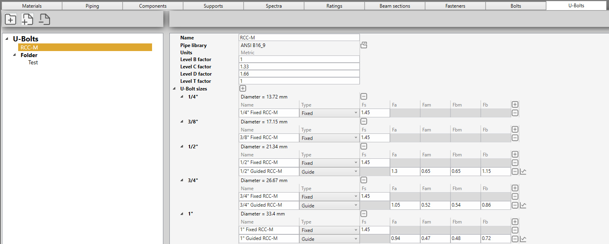
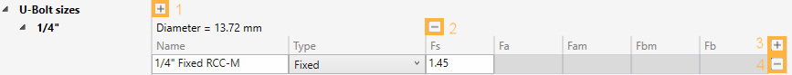
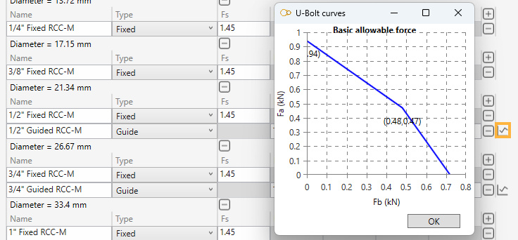

# U-Bolts

In this section, U-bolts library can be created. 

A U-bolt library is a **JSON** file with a name, related to a piping library, units, factors and a list of U-bolts.

The factors will multiply the allowable forces of the U-bolts during calculation based on the current level (B, C, D, T).

## 1. Organisation

On the left panel, you can create folders, sub-folders and U-bolt libraries.

The **-** button is used both for removing folders and libraries.

You can drag a file/folder on another folder.

## 2. U-bolt sizes

Click the **+** button (1) to add a new pipe size from the selected piping library or click the **-** button (2) to remove a size.

## 3. U-bolt

Click the **+** button (3) to add a U-bolt for a specific pipe size or click the **-** button (4) to remove one.

### Types

| Property | Description |
| -------- | ---- |
| Fixed | blocked in all directions |
| Guide | blocked perpendiculary to the pipe |

### Forces

For fixed U-bolts :

| Property | Description | Unit Metric | Unit USA | 
| -------- | ---- | ---- | ---- |
| Fs | Prestressing force in the fixed U-bolt | kN | kips |

For guided U-bolts :

| Property | Description | Unit Metric | Unit USA | 
| -------- | ---- | ---- | ---- |
| Fa | Allowable pulling force in the guided U-bolt | kN | kips |
| Fam | Allowable force in pulling direction (mid point) | kN | kips |
| Fbm | Allowable force in shear direction (mid point) | kN | kips |
| Fb | Allowable shear force in the guided U-bolt | kN | kips |

### Curves

Click on the "Curve" button of guided U-bolts to see the allowable force curve :

