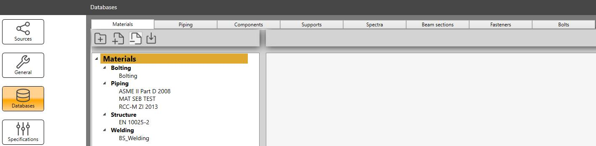

# Databases

MetaPiping lets you create databases of common data as materials, components,  spectra, ratings, beam sections, fasteners, bolts or U-bolts...

The databases are **JSON** files stored in the directory *Databases* in the **Data** source.

[See Sources page for more information](https://documentation.metapiping.com/Settings/Sources.html)

