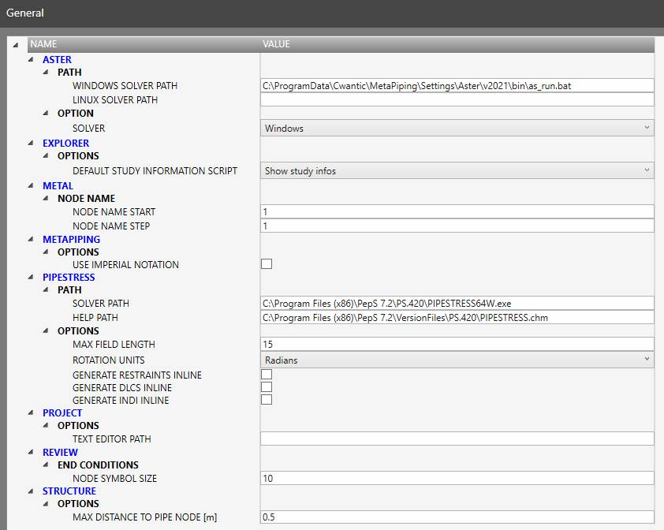

# General

Define all options proposed by all **PLUGINS**.

## 1. Code Aster

Code Aster is the main **SOLVER** of MetaPiping. It is developed and maintained by EDF (https://code-aster.org).

The Windows version is installed by MetaPiping but you can install the Linux version manually and specify the location on your computer.

In this case, you have to select **LINUX** in the option combobox.

## 2. Explorer

The project explorer lets you **calculate** a python script that explores the project/results and show information.

All projects share the same script that you can specify in this option.

[See Info page for more information](https://documentation.metapiping.com/Python/Info.html).

## 3. Metal

**MetaL** is the name of the 3D model inside MetaPiping and also the file extension of the saved file.

You can specify here 2 values (integers):
* The name of the very first node
* The increment for the next node name

In the example, the nodes will start with name "10" then "20", "30", "40"...

## 4. MetaPiping

The application lets the user work with English units. In this case, it is also possible to specify to work with **imperial** notation.

Example: 4"1/8 for a diameter

## 5. PIPESTRESS

For the users of PIPESTRESS that have installed the plugin, they can specify the path of the SOLVER (*PIPESTRESSW.exe* or *PIPESTRESS64W.exe*) and the HELP file (*PIPESTRESS.chm*).

You can also specify:
- Max field length
- Rotation units
- Inline of the restraints, DLCS and INDI

## 6. Project

You can specify the path of your favorite text editor for text report editing.

If blank, MetaPiping uses Windows NotePad.

## 7. Structure

You can specify the maximum distance (in meter) between a pipe node and a structure node during the **Node link** operation. MetaStructure will search structure nodes that are distant less than this value from the selected piping node.