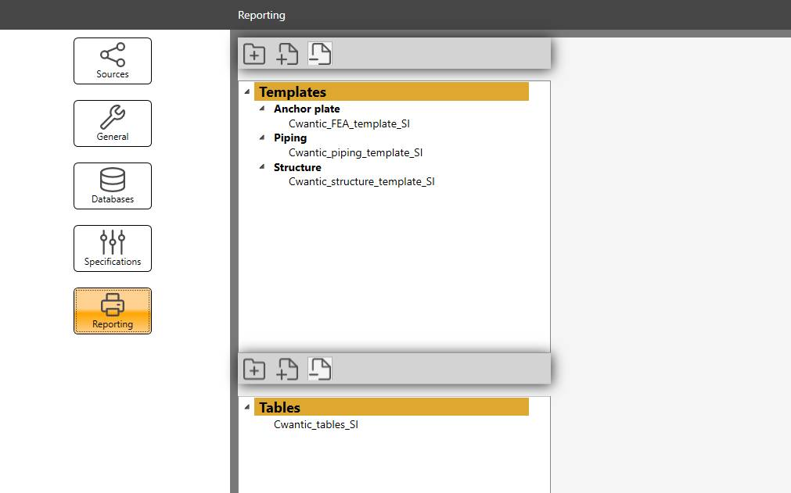
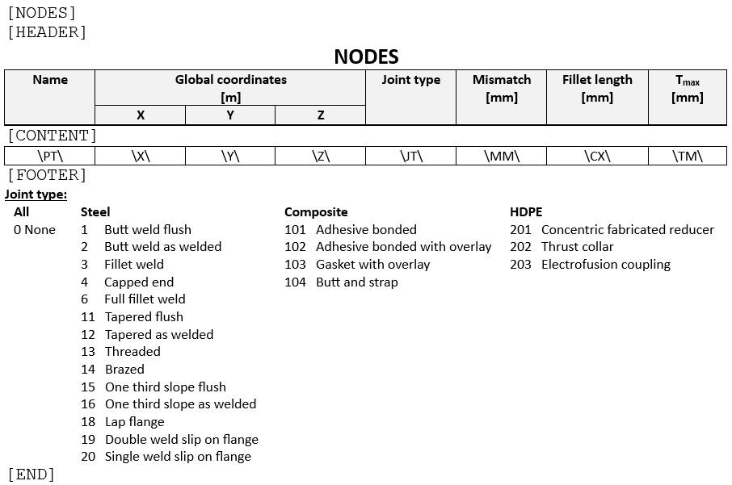

# Reporting



MetaPiping and MetaStructure can generate **reports** with all the details of the model input, some review pictures and all results of an analysis.

The report is exclusively based on *.docx file.

{: .warning }
>ATTENTION, it is mandatory that Microsoft Word must be installed on user computer !

A **report** is based on an empty **template** (*.docx) that contains **keywords**.

A **keyword** is associated to a **section** described in a **table** document (*.docx).

User can prepare **template** document and **table** document and then import them in the software (the first one in the template section, the second in the table section) as shown in the upper figure.

{: .warning }
>ATTENTION, the documents are copied in the settings. The original word files are not moved nor modified.

## 1. Keyword mechanism

The keyword is useful to make a correspondence between the **template** and the **table** document but with specific decorators :

    $$keyword$$ for the template
    [keyword] for the table

Example :

| Keyword | Template keyword | Table keyword |
| -------- | ---- | ---- |
| MATERIALS | `$$`MATERIALS`$$` | [MATERIALS] |

A digit is authorized after a keyword [0..9] to enlarge the possibilities.

Example :

| Keyword | Template keyword | Table keyword |
| -------- | ---- | ---- |
| MATERIALS | `$$`MATERIALS0`$$` -> `$$`MATERIALS9`$$` | [MATERIALS0] -> [MATERIALS9] |

If the software encounters the keyword `$$`MATERIALS3`$$` in the template, it will know that it corresponds to the internal keyword MATERIALS and will try to find the section in the table document with the keyword [MATERIAL3]. If succeed, it will **insert** the content of the table at the position of the template keyword and fill all materials.

{: .warning }
>ATTENTION, the keyword must be written in CAPITAL letters.

## 2. Template

A **template** is a Word *.docx file with user defined layout and content.

MetaPiping/MetaStructure let you **insert** datas from the current study inside the template at a certain position in the document via **keywords**.

### 2.2 Keywords

| Keyword | Module(s) | Description | Other possible keyword or remark |
| -------- | ---- | ---- | ---- |
| STUDY NAME | MetaPiping/MetaStructure/Finite element analysis | The name of the current study | No table |
| PICTURE | MetaPiping/MetaStructure/Finite element analysis | Take a picture (§2.3) | No table |
| SECTIONS | MetaPiping/MetaStructure | The list of all sections | CROSS SECTION |
| MATERIALS | MetaPiping/MetaStructure | The list of all materials | |
| NODES | MetaPiping/MetaStructure | The list of all nodes | NODES INPUT  |
| ELEMENTS | MetaPiping/MetaStructure | The list of all elements | ELEMENTS INPUT |
| ELEMENT COORDINATE SYSTEMS | MetaPiping/MetaStructure | The list of all elements with non default CS | |
| NODE COORDINATE SYSTEMS | MetaPiping/MetaStructure | The list of all DLCS | |
| LUMPED MASSES | MetaPiping/MetaStructure | The list of all lumped masses| |
| SUPPORTS | MetaPiping/MetaStructure | The list of all restraints | SUPPORT |
| STATIC CASES | MetaPiping/MetaStructure | The list of all static cases | |
| EXTERNAL CASES | MetaStructure | The list of all external cases | from linked studies |
| FORCES | MetaPiping/MetaStructure | The list of all nodal load forces | also the external forces (linked study) |
| MOVEMENTS | MetaPiping/MetaStructure | The list of all restraint movements | DISPLACEMENTS |
| OPERATING CONDITIONS | MetaPiping/MetaStructure | The list of all operating conditions | TEMPERATURE & PRESSURE |
| DISTRIBUTED FORCES | MetaPiping/MetaStructure | The list of all distributed forces | |
| WIND | MetaPiping/MetaStructure | The list of all wind forces | |
| SNOW | MetaPiping/MetaStructure | The list of all snow forces | |
| ACCELERATIONS | MetaPiping/MetaStructure | The list of all static accelerations | |
| DENSITIES | MetaPiping | The list of all content densities | |
| STRATIFICATIONS | MetaPiping | The list of all stratifications| |
| COLD SPRINGS | MetaPiping | The list of all cold springs | |
| TRANSIENTS | MetaPiping | The list of all transients | |
| LOAD SETS | MetaPiping | The list of all load sets | |
| SPECTRA | MetaPiping/MetaStructure | The list of all spectra | |
| DYNAMIC EVENTS | MetaPiping/MetaStructure | The list of all dynamic node loads | |
| DYNAMIC CASES | MetaPiping/MetaStructure | The list of all dynamic cases | |
| PRIMARY RESPONSE | MetaPiping/MetaStructure | The list of all primary cases | |
| SECONDARY RESPONSE | MetaPiping/MetaStructure | The list of all secondary cases | |
| COMBINATION CASES | MetaPiping/MetaStructure | The list of all combination cases | |
| COMBINED STRESS CASES | MetaPiping | The list of all combined stress cases | |
| RDISPLACEMENTS | MetaPiping/MetaStructure | The list of all displacement results | Possible JSON parameters (see §3) |
| RFORCES | MetaPiping/MetaStructure | The list of all force and moment results | Possible JSON parameters (see §3) |
| REACTIONS | MetaPiping/MetaStructure | The list of all reaction results | Possible JSON parameters (see §3) |
| STRESSES | MetaPiping/MetaStructure | The list of all stress results | Possible JSON parameters (see §3) |
| ANCHOR PLATES | MetaStructure | The list of all anchor plate results | |
| JOINTS | MetaStructure | The list of all joint results | |
| ANCHORS RESULTS | Finite element analysis | The list of all fastener results | |
| MESH RESULTS | Finite element analysis | The list of all mesh results | |
| ANALYSIS NAME | Finite element analysis | The name of the current analysis | No table |
| CONFIGURATION NAME | Finite element analysis | The name of the current configuration | No table |
| HEIGHT | Finite element analysis | The height of the current assembly | No table |
| MESH SIZE | Finite element analysis | The meshing size | No table |
| IDNODE | Finite element analysis | The name of the current node | No table |
| LOADCASE | Finite element analysis | The current load case | No table |
| STATIC EQUILIBRIUM | Finite element analysis | The static equilibrium value | No table |
| DISPLACEMENT MAX | Finite element analysis | The displacement max | No table |
| STRESS MAX | Finite element analysis | The stress max | No table |
| STRAIN MAX | Finite element analysis | The strain max | No table |
| FASTENER RATIO MAX | Finite element analysis | The max ratio on all fasteners | No table |

### 2.3 Pictures

It is possible to include pictures in the report with use of the keyword **PICTURE**.

When the software encounters this keyword, it simply makes a screenshot of the 3D engine.

It is possible to change the kind of visualization via a **JSON structure** just after the keyword separated by a semicolon character :

    $$PICTURE;{...}$$

### 2.3.1 Piping & structure parameters

JSON parameters :

| Parameter | Description | Default value |
| -------- | ---- | ---- |
| Layers | An array of visible layer name | Empty list = all layers will be visible |
| View | Orientation of the camera | 39 (= FrontFaceTopLeft - see below) |
| Mode | Display mode | 0 (= Shaded - see below) |
| Type | Ribbon type | 0 (= Conception - see below) |
| ReviewType | Review category | 0 (= Sections - see below) |
| ResultType | Result category | 0 (= Displacements - see below) |
| LoadCase | Index of mode or load case in the list | -1 |
| Factor | Amplification factor of the displacements | 1 |
| StressIndex | Index in possible stress list | 0 |
| StressMax | 1 = show the max stress colorisation | 0 |
| ShowNodes | 1 = show node point and name | 0 |
| ShowOrigin | 1 = show origin | 0 |
| ShowAxis | 1 = show axis | 0 |

No parameter is mandatory. If a parameter is not specified, its default value will be used.

View values :

        Front                   = 0
        Right                   = 1
        Rear                    = 2
        Left                    = 3
        Top                     = 4
        Bottom                  = 5
        Isometric               = 6
        Dimetric                = 7
        FrontFaceLeft           = 12
        RightFaceBottom         = 13
        RightFaceRight          = 14
        RightFaceTop            = 15
        RightFaceLeft           = 16
        BackFaceBottom          = 17
        BackFaceRight           = 18
        BackFaceTop             = 19
        BackFaceLeft            = 20
        LeftFaceBottom          = 21
        LeftFaceRight           = 22
        LeftFaceTop             = 23
        LeftFaceLeft            = 24
        BottomFaceBottom        = 25
        BottomFaceRight         = 26
        BottomFaceTop           = 27
        BottomFaceLeft          = 28
        TopFaceBottom           = 29
        TopFaceRight            = 30
        TopFaceTop              = 31
        TopFaceLeft             = 32
        FrontFaceBottomLeft     = 33
        FrontFaceBottomRight    = 34
        FrontFaceTopLeft        = 35
        FrontFaceTopRight       = 36
        BackFaceBottomLeft      = 37
        BackFaceBottomRight     = 38
        BackFaceTopLeft         = 39
        BackFaceTopRight        = 40

Mode values :

        Shaded = 0
        Hiddenlines = 1
        Iso = 2

Type values :

        Conception  = 0
        Loads       = 10
        Review      = 20
        Analysis    = 30

Review type values :

        Sections = 0
        Materials = 10
        Specifications = 20
        StressOff = 30
        Soils = 40
        Codes = 50
        RoomTemperatures = 60
        DesignConditions = 70

Result type values :

        None = -1
        Displacements = 0
        Reactions = 1
        Forces = 2
        RestraintForces = 3
        Stresses = 4
        Anchors = 5
        Joints = 6

Examples:

```
    $$PICTURE$$
```

```
    $$PICTURE;{“View”:35}$$
```

```
    $$PICTURE;{”Type”:20,”ReviewType“:10,“View”:35}$$
```

```
    $$PICTURE;{”Type”:30,”ResultType“:0,”Layers”:[“0”],”LoadCase”:100,“View”:35,”Factor”:8}$$
```

### 2.3.2 Finite element analysis parameters

JSON parameters :

| Parameter | Description | Default value |
| -------- | ---- | ---- |
| Groups | An array of visible group name | Empty list = all groups will be visible |
| View | Orientation of the camera | 35 (= FrontFaceTopLeft - see above) |
| ResultType | Result category | 0 (= Group - see below) |
| Factor | Amplification factor of the displacements | 1 |
| Dim | 1 = show dimensions | 1 |

Result type values :

        Group = 0
        Displacement = 1
        Stress = 2
        Strain = 3
        Compression = 4
        IsoDisplacement = 5
        IsoStress = 6
        IsoStrain = 7
        IsoCompression = 8

Examples:

```
    $$PICTURE$$
```

```
    $$PICTURE;{“ResultType”:2,”Groups”:[“PLATE”],”View”:4,”Dim”:0}$$
```

## 3. Results params

For **results** keywords, it is possible to filter the output via a **JSON structure** just after the keyword separated by a semicolon character :

    $$RDISPLACEMENTS;{...}$$
    $$RFORCES;{...}$$
    $$REACTIONS;{...}$$
    $$STRESSES;{...}$$

JSON parameters :

| Parameter | Description | Default value |
| -------- | ---- | ---- |
| Layers | An array of visible layer name | Empty list = all layers will be visible |
| Loadcase | A loadcase number | -1 (all loadcases) |
| StressIndex | A stress index | 0 (for stress results only) |

Examples:

```
    $$RDISPLACEMENTS$$
```

This will show a table with all displacements (all layers) for all loadcases.

```
    $$RDISPLACEMENTS;{”Layers”:[“0”,"1"],”LoadCase”:100}$$
```

This will show a table with the displacements of nodes from layer "0" and "1" and only for loadcase 100.

You can combine in your report a **picture** and a result **table** :

```
FORCES & MOMENTS:
-----------------

1) Loadcase 100 - layer 0

        $$PICTURE;{”Type”:30,”ResultType“:2,”Layers”:[“0”],”LoadCase”:100,“View”:35}$$

$$RFORCES;{”Layers”:[“0”],”LoadCase”:100}$$
```

This will first show a **PICTURE** (see §2.3.1) :

| Parameter | Description |
| -------- | ---- |
| ”Type”:30 | Analysis screen  |
| ”ResultType“:2 | Forces |
| ”Layers”:[“0”] | Only elements of layer "0" |
| ”LoadCase”:100 | Only for loadcase number 100 |
| “View”:35 | FrontFaceTopLeft view |

...followed by a **table** :

| Parameter | Description |
| -------- | ---- |
| ”Layers”:[“0”] | Only results of elements of layer "0"  |
| ”LoadCase”:100 | Only for loadcase number 100 |

## 4. Table

A **table** is a Word *.docx file with user defined layout and content based on predefined keyword and structure.

A **table** can define several keyword content.

The layout of a keyword content is :

    [KEYWORD]
    [HEADER]
    [CONTENT]
    [FOOTER]
    [END]

The table's **[KEYWORD]** corresponds to the template's **`$$`KEYWORD`$$`**.

Example for `$$`NODES`$$` :



Between the **[HEADER]** section and the **[CONTENT]** section, user can define an introduction of the table, a title and table headers and units.

Between the **[CONTENT]** section and the **[FOOTER]** section, user can define a one line table (aligned with the header). On each cell, user can define **properties**. The software will repeat this row with every item of this type and fill the properties.

Between the **[FOOTER]** section and the **[END]** section, user can define a conclusion of the table or some remarks.

### 4.1 Properties

Depending of the type of the keyword, properties are recoverable.

A property is defined between 2 backslashes \XX\

### 4.1.1 Pipe section

| Property | Description | Unit Metric | Unit USA |
| -------- | ---- | ---- | ---- |
| \CD\ | Name | - | - |
| \AL\ | Description | - | - |
| \OD\ | Diameter | mm | in |
| \ID\ | Inside diameter | mm | in |
| \WT\ | Thickness | mm | in |
| \IN\ | Insulation thickness | mm | in |
| \SO\ | Operating density | - | - |
| \ST\ | Test density | - | - |
| \MA\ | Linear mass | kg/m | lb/ft |
| \CO\ | Corrosion | mm | in |
| \CI\ | Erosion | mm | in |
| \OV\ | Ovalization ratio | - | - |
| \LI\ | Liner thickness | mm | in |
| \TC\ | TopCoat thickness | mm | in |
| \EM\ | Special thickness | mm | in |
| \BT | Bend thickness | mm | in |

### 4.1.2 Beam section

| Property | Description | Unit Metric | Unit USA |
| -------- | ---- | ---- | ---- |
| \CD\ | Name | - | - |
| \AL\ | Description | - | - |
| \H\ | Height | mm | in |
| \B\ | Basis | mm | in |
| \TW\ | Web thickness | mm | in |
| \TF\ | Flange thickness | mm | in |
| \IX\ | Bending inertia X | cm^4 | in^4 |
| \IY\ | Bending inertia Y | cm^4 | in^4 |
| \IT\ | Torsional inertia | cm^4 | in^4 |
| \A\ | Area | cm² | in² |
| \AX\ | Reduced area X | cm² | in² |
| \AY\ | Reduced area Y | cm² | in² |

### 4.1.3 Regular material

| Property | Description | Unit Metric | Unit USA |
| -------- | ---- | ---- | ---- |
| \CD\ | Name | - | - |
| \AL\ | Description | - | - |
| \SG\ | Poisson's ratio | - | - |
| \TX\ | Temperature max | °C | °F |
| \TA\ | Temperature ref | °C | °F |
| \RO\ | Density | kg/m³ | lb/ft³ |
| \TE\ | Temperature i | °C | °F |
| \EX\ | Thermal Expansion | 10^-6.mm/mm/°C | 10^-6.in/in/°F |
| \EH\  | Modulus of Elasticity | kN/mm² | 10^6.psi |
| \SH\ | Non-Class 1 Allowable Stress | N/mm² | ksi |
| \SY\ | Yield Stress | N/mm² | ksi |
| \SU\ | Ultimate Tensile Stress | N/mm² | ksi |
| \SM\ | Class 1 Allowable Stress | N/mm² | ksi |
| \CR\ | Creep | N/mm² | ksi |
| \GH\ | Shear Modulus | kN/mm² | 10^6.psi |
| \CO\ | Class 1 Thermal Conductivity | kJ/hr/m/°C | btu/hr/ft/°F |
| \DI\ | Class 1 Thermal Diffusivity | mm²/s | ft²/hr |
| \E2\ | Modulus of Elasticity 2 | kN/mm² | 10^6.psi |

### 4.1.4 Node

| Property | Description | Unit Metric | Unit USA |
| -------- | ---- | ---- | ---- |
| \PT\ | Name | - | - |
| \X\ | X global coordinate | m | ft |
| \Y\ | Y global coordinate | m | ft |
| \Z\ | Z global coordinate | m | ft |
| \JT\ | Joint type (see below) | - | - |
| \MM\ | Mismatch for welded joints | mm | in |
| \CX\ | Length of fillet weld Cx | mm | in |
| \TM\ | for Class 1 transition within 1:3 slope envelope | mm | in |

Joint type values :

        None = 0
        // For steel
        ButtWeldFlush = 1
        ButtWeldAsWelded = 2
        FilletWeld = 3
        CappedEnd = 4
        FullFilletWeld = 6
        TaperedFlush = 11
        TaperedAsWelded = 12
        Threaded = 13
        Brazed = 14
        OneThirdSlopeFlush = 15
        OneThirdSlopeAsWelded = 16
        LapFlange = 18
        DoubleWeldSlipOnFlange = 19
        SingleWeldSlipOnFlange = 20
        // For composite
        AdhesiveBonded = 101
        AdhesiveBondedWithOverlay = 102
        GasketWithOverlay = 103
        ButtAndStrap = 104
        // For HDPE
        ConcentricFabricatedReducer = 201
        ThrustCollar = 202
        ElectrofusionCoupling = 203

### 4.1.5 Element

| Property | Description | Unit Metric | Unit USA |
| -------- | ---- | ---- | ---- |
| \TY\ | Type | - | - |
| \PT1\ | Node1 name | - | - |
| \PT2\ | Node2 name | - | - |
| \LE\ | Length | m | ft |
| \RA\ | Bend radius (only for bend) | m | ft |
| \MA\ | Material description | - | - |
| \AL\ | Label | - | - |
| \XX\ | X-axis direction on X | - | - |
| \XY\ | X-axis direction on Y | - | - |
| \XZ\ | X-axis direction on Z | - | - |
| \CS\ | Section description | - | - |
| \CL\ | Piping code (empty for beam) | - | - |

Special properties for beam :

| Property | Description | Unit Metric | Unit USA |
| -------- | ---- | ---- | ---- |
| \J1\ | Joint type on Node 1 (see below) | - | - |
| \J2\ | Joint type on Node 2 (see below) | - | - |
| \BX\ | Buckling on X | - | - |
| \BY\ | Buckling on Y | - | - |
| \BZ\ | Buckling on Z | - | - |
| \LTB\ | Lateral Torsional Buckling (see below) | - | - |

Joint type values :

        None = 0
        Joint = 1
        BoltedJoint = 2
        WeldedJoint = 3

Lateral Torsional Buckling values :

        None = 0
        BothHingedUniform = 1
        BothHingedNodal = 2
        BothFixedUniform = 3
        BothFixedNodal = 4
        Moments = 5
        CantileverUniform = 6
        CantileverNodal = 7

### 4.1.6 DLCS

| Property | Description | Unit Metric | Unit USA |
| -------- | ---- | ---- | ---- |
| \PT\ | Node name | - | - |
| \XX\ | X-axis direction on X | - | - |
| \XY\ | X-axis direction on Y | - | - |
| \XZ\ | X-axis direction on Z | - | - |
| \ZX\ | Z-axis direction on X | - | - |
| \ZY\ | Z-axis direction on Y | - | - |
| \ZZ\ | Z-axis direction on Z | - | - |

### 4.1.7 Lumped mass

| Property | Description | Unit Metric | Unit USA |
| -------- | ---- | ---- | ---- |
| \PT\ | Node name | - | - |
| \X\ | X global coordinate | m | ft |
| \Y\ | Y global coordinate | m | ft |
| \Z\ | Z global coordinate | m | ft |
| \MA\ | Mass | ton | kips |

### 4.1.8 Restraint

| Property | Description | Unit Metric | Unit USA |
| -------- | ---- | ---- | ---- |
| \PT\ | Node name | - | - |
| \AL\ | Restraint type | - | - |
| \LO\ | Coordinate system (see below) | - | - |
| \LV\ | Level | - | - |
| \DESCR\ | Label | - | - |
| \SX\ | Translation stiffness on X | kN/mm | Kips/in |
| \SY\ | Translation stiffness on Y | kN/mm | Kips/in |
| \SZ\ | Translation stiffness on Z | kN/mm | Kips/in |
| \SPX\ | Rotation stiffness on X | kN.m/rad | Kips.ft/rad |
| \SPY\ | Rotation stiffness on Y | kN.m/rad | Kips.ft/rad |
| \SPZ\ | Translation stiffness on Z | kN.m/rad | Kips.ft/rad |
| \FO\ | Pre-compression/pre-tension force | kN | Kips |

Coordinate system values :

        G = Global
        L = Local to attached element
        N = Local to node's DLCS

### 4.1.9 Static case : Forces & moments on node

| Property | Description | Unit Metric | Unit USA |
| -------- | ---- | ---- | ---- |
| \PT\ | Node name | - | - |
| \CA\ | Load number | - | - |
| \TI\ | Load title | - | - |
| \FX\ | Force on X | kN | kips |
| \FY\ | Force on Y | kN | kips |
| \FZ\ | Force on Z | kN | kips |
| \MX\ | Moment on X | kN.m | kips.ft |
| \MY\ | Moment on Y | kN.m | kips.ft |
| \MZ\ | Moment on Z | kN.m | kips.ft |
| \LO\ | Local | - | - |

### 4.1.10 Static case : Restraints movement

| Property | Description | Unit Metric | Unit USA |
| -------- | ---- | ---- | ---- |
| \PT\ | Node name | - | - |
| \CA\ | Load number | - | - |
| \TI\ | Load title | - | - |
| \DX\ | Displacement on X | mm | in |
| \DY\ | Displacement on Y | mm | in |
| \DZ\ | Displacement on Z | mm | in |
| \RX\ | Rotation on X | rad | rad |
| \RY\ | Rotation on Y | rad | rad |
| \RZ\ | Rotation on Z | rad | rad |

### 4.1.11 Static case : Distributed loads

| Property | Description | Unit Metric | Unit USA |
| -------- | ---- | ---- | ---- |
| \TY\ | Type | - | - |
| \PT1\ | Node1 name | - | - |
| \PT2\ | Node2 name | - | - |
| \CA\ | Load number | - | - |
| \TI\ | Load title | - | - |
| \X\ | Load on X | N/m | lb/ft |
| \Y\ | Load on Y | N/m | lb/ft |
| \Z\ | Load on Z | N/m | lb/ft |

### 4.1.12 Static case : Wind loads

| Property | Description | Unit Metric | Unit USA |
| -------- | ---- | ---- | ---- |
| \TY\ | Type | - | - |
| \PT1\ | Node1 name | - | - |
| \PT2\ | Node2 name | - | - |
| \CA\ | Load number | - | - |
| \TI\ | Load title | - | - |
| \PR\ | Pressure | N/m² | lb/ft² |
| \X\ | Wind direction on X | - | - |
| \Y\ | Wind direction on Y | - | - |
| \Z\ | Wind direction on Z | - | - |

### 4.1.13 Static case : Snow loads

| Property | Description | Unit Metric | Unit USA |
| -------- | ---- | ---- | ---- |
| \TY\ | Type | - | - |
| \PT1\ | Node1 name | - | - |
| \PT2\ | Node2 name | - | - |
| \CA\ | Load number | - | - |
| \TI\ | Load title | - | - |
| \PR\ | Pressure | N/m² | lb/ft² |

### 4.1.14 Static case : Operating conditions

| Property | Description | Unit Metric | Unit USA |
| -------- | ---- | ---- | ---- |
| \TY\ | Type | - | - |
| \PT1\ | Node1 name | - | - |
| \PT2\ | Node2 name | - | - |
| \CA\ | Load number | - | - |
| \TI\ | Load title | - | - |
| \TE\ | Temperature | °C | °F |
| \PR\ | Pressure | N/m² | lb/ft² |

### 4.1.15 Static case : Densities

| Property | Description | Unit Metric | Unit USA |
| -------- | ---- | ---- | ---- |
| \TY\ | Type | - | - |
| \PT1\ | Node1 name | - | - |
| \PT2\ | Node2 name | - | - |
| \CA\ | Load number | - | - |
| \TI\ | Load title | - | - |
| \RO\ | Density | - | - |

### 4.1.16 Static case : Stratifications

| Property | Description | Unit Metric | Unit USA |
| -------- | ---- | ---- | ---- |
| \TY\ | Type | - | - |
| \PT1\ | Node1 name | - | - |
| \PT2\ | Node2 name | - | - |
| \CA\ | Load number | - | - |
| \ME\ | Stratification method (see below) | - | - |
| \AL\ | Mean coef. of thermal expansion of pipe | 10^-6mm/mm/°C | 10^-6in/in/°F |
| \T1\ | Temperature at bottom of the pipe or temp. gradient Gu | °C or °C/mm | °F or °F/in |
| \T2\ | Temperature at top of the pipe or temp. gradient Gv | °C or °C/mm | °F or °F/in |
| \V1\ | Vertical coordinate of the discontinuity or laminar flow down | mm | in |
| \V2\ | Vertical coordinate of the laminar flow up | mm | in |
| \X\ | X component of the local V vector | - | - |
| \Y\ | Y component of the local V vector | - | - |
| \Z\ | Z component of the local V vector | - | - |

Stratification method values :

        HorizontalLinear = 0
        HorizontalStep = 1
        HorizontalLaminar = 2
        HorizontalGu = 3
        Skewed = 4
        General = 5

### 4.1.17 Static case : Cold springs

| Property | Description | Unit Metric | Unit USA |
| -------- | ---- | ---- | ---- |
| \TY\ | Type | - | - |
| \PT1\ | Node1 name | - | - |
| \PT2\ | Node2 name | - | - |
| \CA\ | Load number | - | - |
| \LE\ | Length change | mm | in |

### 4.1.18 Static case : Accelerations

| Property | Description | Unit Metric | Unit USA |
| -------- | ---- | ---- | ---- |
| \TY\ | Type | - | - |
| \PT1\ | Node1 name | - | - |
| \PT2\ | Node2 name | - | - |
| \CA\ | Load number | - | - |
| \TI\ | Load title | - | - |
| \GX\ | Fraction of G on X | - | - |
| \GY\ | Fraction of G on Y | - | - |
| \GZ\ | Fraction of G on Z | - | - |

### 4.1.19 Static case

| Property | Description | Unit Metric | Unit USA |
| -------- | ---- | ---- | ---- |
| \CA\ | Load number | - | - |
| \TI\ | Load title | - | - |
| \TY\ | Load category (see below) | - | - |
| \LV\ | Level | - | - |
| \EQ\ | Equation (see below) | - | - |
| \CF\ | Check fasteners (structure only) | - | - |

Category values :

        OperatingWeight = 0
        TestWeight = 1
        EmptyWeight = 2
        DesignWeight = 3
        Wind = 4
        Snow = 5
        Distributed = 6
        Acceleration = 7
        SAM = 8
        Thermal = 9
        Settlement = 10
        ColdSpring = 11
        Dummy = 12
        UserDefined = 13

Equation values :

        None (no stress calculation) = 1
        Equation 6 (sustained) = 2
        Equation 10 B (occasional) = 3
        Equation 10 C (occasional) = 4
        Equation 10 D (occasional) = 5
        Equation 10 T (test) = 6
        Equation 7 (thermal expansion) = 7
        Equation 8 (thermal expansion + sustained) = 8
        Equation 9 (settlement) = s

### 4.1.20 Time history event : Dynamic forces & moments on node

| Property | Description | Unit Metric | Unit USA |
| -------- | ---- | ---- | ---- |
| \PT\ | Node name | - | - |
| \TI\ | Event title | - | - |
| \FX\ | Force on X | kN | kips |
| \FY\ | Force on Y | kN | kips |
| \FZ\ | Force on Z | kN | kips |
| \MX\ | Moment on X | kN.m | kips.ft |
| \MY\ | Moment on Y | kN.m | kips.ft |
| \MZ\ | Moment on Z | kN.m | kips.ft |

### 4.1.21 Time history cases

| Property | Description | Unit Metric | Unit USA |
| -------- | ---- | ---- | ---- |
| \CA\ | Load number | - | - |
| \TI\ | Load title | - | - |
| \LV\ | Level | - | - |
| \EQ\ | Equation (see above) | - | - |
| \EV\ | Event number | - | - |
| \DA\ | Damping value | - | - |
| \RC\ | Rigid correction | - | - |
| \RM\ | Resultant moment | - | - |
| \ES\ | Explicit scheme | - | - |
| \TS\ | Time step | - | - |
| \AR\ | Archive rate | - | - |
| \CF\ | Check fasteners (structure only) | - | - |

### 4.1.22 Class 1 thermal case : Transients

| Property | Description | Unit Metric | Unit USA |
| -------- | ---- | ---- | ---- |
| \TY\ | Type | - | - |
| \PT1\ | Node1 name | - | - |
| \PT2\ | Node2 name | - | - |
| \CA\ | Load number | - | - |
| \TI\ | Load title | - | - |
| \TR\ | Transient name | - | - |

### 4.1.23 Class 1 case : Load sets

| Property | Description | Unit Metric | Unit USA |
| -------- | ---- | ---- | ---- |
| \TI\ | Load title | - | - |
| \RF\ | Reference case number | - | - |
| \SI\ | Situation number | - | - |
| \TR\ | Thermal case number | - | - |
| \CY\ | Number of cycles | - | - |
| \PR\ | Pressure case number | - | - |
| \MO\ | Moment case number | - | - |
| \DY\ | Dynamic load flag | - | - |

### 4.1.24 Spectrum

| Property | Description | Unit Metric | Unit USA |
| -------- | ---- | ---- | ---- |
| \EV\ | Event number | - | - |
| \TI\ | Load title | - | - |
| \NA\ | Spectrum name | - | - |
| \XA\ | Period or frequency | - | - |
| \ME\ | Interpolation method (see below) | - | - |
| \SH\ | Shift value | % | % |
| \DA\ | Damping value | - | - |
| \DU\ | Duration value | s | s |

Interpolation method values :

        Linear / Linear acceleration = 0
        Linear frequency / Linear acceleration = 1
        Linear period / Linear acceleration = 2
        Log frequency / Linear acceleration = 3
        Log frequency / Log acceleration = 4

### 4.1.25 Primary floor response cases

| Property | Description | Unit Metric | Unit USA |
| -------- | ---- | ---- | ---- |
| \CA\ | Load number | - | - |
| \TI\ | Load title | - | - |
| \LV\ | Level | - | - |
| \EV\ | Event number | - | - |
| \EQ\ | Equation (see above) | - | - |
| \IM\ | Inter modal combination (see below) | - | - |
| \IL\ | Inter level combination (see below) | - | - |
| \OR\ | Order (see below) | - | - |
| \RC\ | Rigid correction (see below) | - | - |
| \X\ | X factor | - | - |
| \Y\ | Y factor | - | - |
| \Z\ | Z factor | - | - |
| \CF\ | Check fasteners (structure only) | - | - |

Inter modal combination values :

        Grouping = 1
        Ten percent = 2
        Double sum = 3
        SRSS = 4
        All coupling = 5
        Rosenblueth = 6
        Der Kiureghian = 7

Inter level combination values :

        Absolute without phase = 0
        SRSS without phase = 1
        Algebraic = 2
        Absolute with phase = 3
        SRSS with phase = 4
        Envelope = 5
        SRSS with counterphase = 6

Order values :

        Interlevel / Intermodal / Interspatial = 0
        Interlevel / Interspatial / Intermodal = 1
        Intermodal / Interlevel / Interspatial = 2

Rigid correction values :

        SRSS = 0
        None = 1
        Absolute = 2
        SRSS with modal = 3
        Gupta = 4
        Lindley-Yow = 5

### 4.1.26 Secondary floor response cases

| Property | Description | Unit Metric | Unit USA |
| -------- | ---- | ---- | ---- |
| \CA\ | Load number | - | - |
| \TI\ | Load title | - | - |
| \LV\ | Level | - | - |
| \EV\ | Event number | - | - |
| \EQ\ | Equation (see above) | - | - |
| \ME\ | Method of combination (see below) | - | - |
| \TP\ | Treat as primary | - | - |
| \X\ | X factor | - | - |
| \Y\ | Y factor | - | - |
| \Z\ | Z factor | - | - |
| \CF\ | Check fasteners (structure only) | - | - |

Combination method values :

        Absolute = 0
        SRSS = 1

### 4.1.27 Combination cases

| Property | Description | Unit Metric | Unit USA |
| -------- | ---- | ---- | ---- |
| \CA\ | Load number | - | - |
| \TI\ | Load title | - | - |
| \RF\ | Reference case number | - | - |
| \LV\ | Level | - | - |
| \EQ\ | Equation (see above) | - | - |
| \ME\ | Method of combination (see below) | - | - |
| \DY\ | Dynamic load flag | - | - |
| \CY\ | Number of cycles | - | - |
| \TY\ | Analysis type | - | - |
| \C1\ | factor(i) x case(i) | - | - |
| \CF\ | Check fasteners (structure only) | - | - |

Combination method values :

        Algebraic = 0
        Absolute = 1
        SRSS = 2
        Seismic = 3
        MaxAbsolute = 4
        MaxResultant = 5
        MaxAlgebraic = 6
        MinAlgebraic = 7
        Range = 8
        MomentRange = 9
        StressRange = 10

### 4.1.28 Combination stress cases

| Property | Description | Unit Metric | Unit USA |
| -------- | ---- | ---- | ---- |
| \CA\ | Load number | - | - |
| \TI\ | Load title | - | - |
| \RF\ | Reference case number | - | - |
| \LV\ | Level | - | - |
| \EQ\ | Equation (see above) | - | - |
| \ME\ | Method of combination (see above) | - | - |
| \MU\ | Allowable multiplier | - | - |
| \MA\ | factor x sustained load case | - | - |
| \MB\ | factor x occasional load case | - | - |
| \MC\ | factor x thermal load case | - | - |

### 4.1.29 External cases

| Property | Description |
| -------- | ---- |
| \CA\ | Load number |
| \TI\ | Load title |
| \SN\ | External study name |
| \LC\ | External study load case number |

### 4.1.30 Results : Displacements

| Property | Description | Unit Metric | Unit USA |
| -------- | ---- | ---- | ---- |
| \PT\ | Node name | - | - |
| \CA\ | Load number | - | - |
| \TI\ | Load title | - | - |
| \DX\ | X global displacement | mm | in |
| \DY\ | Y global displacement  | mm | in |
| \DZ\ | Z global displacement  | mm | in |
| \RX\ | X global rotation | Rad | Rad |
| \RY\ | Y global rotation  | Rad | Rad |
| \RZ\ | Z global rotation  | Rad | Rad |

### 4.1.31 Results : Forces & moments on element's nodes

| Property | Description | Unit Metric | Unit USA |
| -------- | ---- | ---- | ---- |
| \TY\ | Type | - | - |
| \PT\ | Node extremity name | - | - |
| \CA\ | Load number | - | - |
| \TI\ | Load title | - | - |
| \FX\ | Force on X | N | lb |
| \FY\ | Force on Y | N | lb |
| \FZ\ | Force on Z | N | lb |
| \MX\ | Moment on X | N.m | lb.ft |
| \MY\ | Moment on Y | N.m | lb.ft |
| \MZ\ | Moment on Z | N.m | lb.ft |

### 4.1.32 Results : Reactions on restraint's node

| Property | Description | Unit Metric | Unit USA |
| -------- | ---- | ---- | ---- |
| \PT\ | Node name | - | - |
| \CA\ | Load number | - | - |
| \TI\ | Load title | - | - |
| \FX\ | Force on X | N | lb |
| \FY\ | Force on Y | N | lb |
| \FZ\ | Force on Z | N | lb |
| \MX\ | Moment on X | N.m | lb.ft |
| \MY\ | Moment on Y | N.m | lb.ft |
| \MZ\ | Moment on Z | N.m | lb.ft |

### 4.1.33 Results : Stresses on elements

| Property | Description | Unit Metric | Unit USA |
| -------- | ---- | ---- | ---- |
| \TY\ | Type | - | - |
| \PT1\ | Node 1 name | - | - |
| \PT2\ | Node 2 name | - | - |
| \CA\ | Load number | - | - |
| \TI\ | Load title | - | - |
| \ST\ | Stress max | N/mm² | ksi |

### 4.1.34 Results : Anchor plate max ratios

| Property | Description | Unit Metric | Unit USA |
| -------- | ---- | ---- | ---- |
| \PT\ | Node name | - | - |
| \CA\ | Load number | - | - |
| \TI\ | Load title | - | - |
| \RA\ | Ratio max | - | - |

### 4.1.35 Results : Beam joint ratios

| Property | Description | Unit Metric | Unit USA |
| -------- | ---- | ---- | ---- |
| \TY\ | Type | - | - |
| \PT\ | Node name | - | - |
| \CA\ | Load number | - | - |
| \TI\ | Load title | - | - |
| \RA\ | Ratio max | - | - |

### 4.1.36 Results : Finite element analysis fastener report

| Property | Description | Unit Metric | Unit USA |
| -------- | ---- | ---- | ---- |
| \LINE\ | Report line(i) | - | - |

### 4.1.37 Results : Finite element analysis node

| Property | Description | Unit Metric | Unit USA |
| -------- | ---- | ---- | ---- |
| \ID\ | Node id | - | - |
| \X\ | X coordinate | mm | in |
| \Y\ | Y coordinate | mm | in |
| \Z\ | Z coordinate | mm | in |
| \UX\ | X displacement | mm | in |
| \UY\ | Y displacement | mm | in |
| \UZ\ | Z displacement | mm | in |
| \STRESS\ | Stress | N/mm² | ksi |
| \STRAIN\ | Strain | % | % |
| \CO\ | Compression | N/mm² | ksi |
