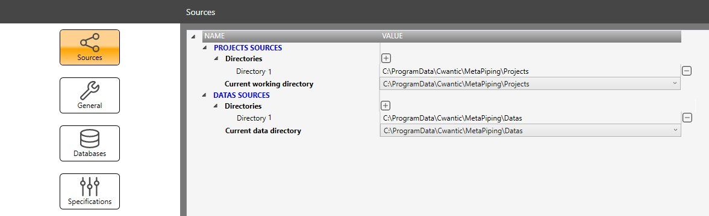
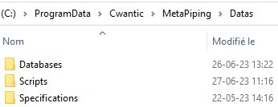

# Sources

## 1. Projects sources

Define the *local directory* or *server directory* where all the projects will be saved. [See Project page for more information](https://documentation.metapiping.com/Explorer/Project.html).

After installation, the default directory will be:

    C:\ProgramData\Cwantic\MetaPiping\Projects

You can add supplement directories by clicking the **+** button and remove others by clicking **-** button.

There must be at least one working directory.

This way you can organize yourself by splitting the projects into main categories and/or for sharing project between users.

## 2. Data sources

Define the *local directory* or *server directory* where all the data will be saved.

The data directory is the directory where the **databases**, the python **scripts** and the **specifications** are saved.

[See Database page for more information](https://documentation.metapiping.com/Settings/Databases/index.html).

[See Python page for more information](https://documentation.metapiping.com/Python/index.html).

[See Specification page for more information](https://documentation.metapiping.com/Settings/Specifications.html).

After installation, the default directory will be:

    C:\ProgramData\Cwantic\MetaPiping\Datas

You can add supplement directories by clicking the **+** button and remove others by clicking **-** button.

There must be at least one data directory.

This way you can easily share your own data.
