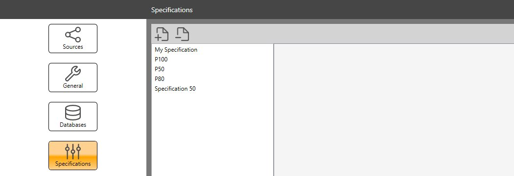
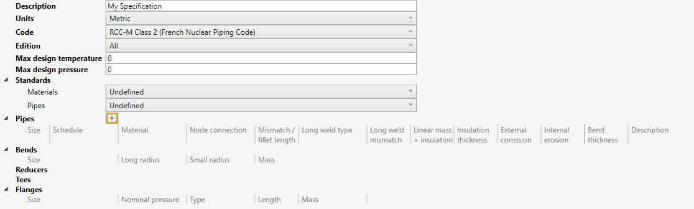
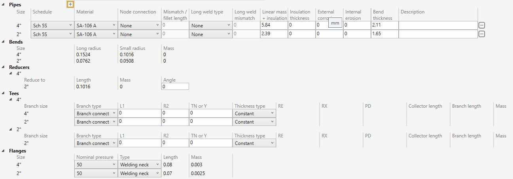
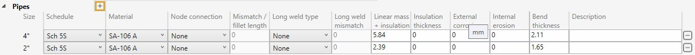
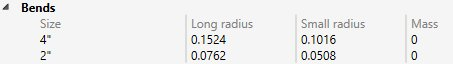
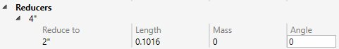

# Specifications

MetaPiping let you create **specifications** = predefined choice of piping elements and properties dedicated to a particular project.

It brings together a variety of information :

- Calculation code and edition
- Library of materials
- Library of piping elements

Click the **+** button to add a new specification or click the **-** button to remove an **unused** one.

>ATTENTION, do not remove specification used in one or more projects otherwise the opening will be compromised.

## 1. Header

Properties :

- Units                         - Metric or USA
- Code                          - See [Codes](https://documentation.metapiping.com/Analysis/Codes.html) for more information
- Edition                       - See [Codes](https://documentation.metapiping.com/Analysis/Codes.html) for more information
- Max design temperature        - °C or °F
- Max design pressure           - N/mm² or psi
- Material library              - See [Materials](https://documentation.metapiping.com/Settings/Databases/Materials.html) for more information
- Piping library                - See [Piping](https://documentation.metapiping.com/Settings/Databases/Piping.html) for more information

> ATTENTION, a specification has UNITS, so only libraries of materials and piping elements with the same UNITS can be connected.

> ATTENTION, when starting a new project, be sure to select a specification that will be compatible with the Units, Code and Edition of the project and do not change these 3 properties during design.

## 2. Elements

To create a **specification**, just click to **+** button and select several pipe sizes :

MetaPiping fills automatically the tables and let you make some choices.

## 2.1 Pipes

For each size, define the **schedule** and the **material**. A **pipe** knows now its section and its material :

Select then the **node connections** of the pipe between :
- None
- Butt weld - flush
- Butt weld - as welded
- Fillet weld
- Full fillet weld
- Threaded
- Brazed

Based on this property, define the **mismatch** or the **fillet length** [mm or in].

Select then the **Long weld type** of the pipe between :
- None
- Butt weld flush
- Butt weld as welde

Based on this property, define the **Long weld mismatch** [mm or in].

Other properties :

| Property | Unit Metric | Unit USA | Default |
| -------- | ---- | ---- | -- |
| Linear mass + insulation | kg/m | lb/ft | Linear mass of the pipe |
| Insulation thickness | mm |in | 0 |
| External corrosion | mm | in | 0 |
| Internal erosion | mm | in | 0 |
| Bend thickness | mm | in | Thickness of the pipe |

## 2.2 Bends

MetaPiping automatically fills the table with the corresponding informations :

Just informative.

    To know the UNIT of a property, just let the mouse over the property name.

## 2.3 Reducers

MetaPiping automatically fills the table with the corresponding informations :

The property **Angle** can be filled for **Class 1** calculation code.

    To know the UNIT of a property, just let the mouse over the property name.

## 2.4 Tees

