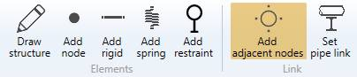
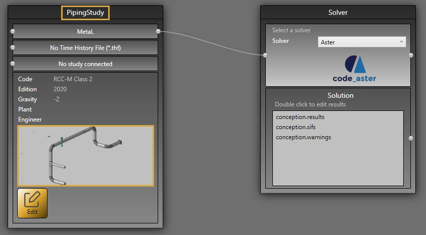

# Adjacent nodes

This tool is usefull to construct *structure* nodes around *piping* nodes.

Imagine a small piping system with a **restraint** on a node :

We want to build a **support** at this node.

## 1. Piping

Create a **piping** study and draw the model :

## 2. Support

Create a **structure** study and add a **link** to *PipingStudy* :

Set the calculation code, add materials and beams.

## 3. Structure nodes

When you click on the **Add adjacent nodes** button without selection, the left panel shows a message :

The **selection mode** is automatically set to **POINT**. You can so directly select a node.

Select a piping node with a restraint :

MetaStructure proposes to create up to 4 nodes perpendicular to the pipe direction.

Checkboxes let you select the desired nodes.

The left panel shows the pipe ray at the selected node and for the 4 directions, the distance of the new nodes.

The default value (0.07 in this example) corresponds to half the height of the current beam (IPE 140) :

| Property | Unit Metric | Unit USA |
| -------- | ---- | ---- |
| Distance | m | ft |

Select only the bottom node and click on the **Create** button :

The **structure** node 1 is created :

>The piping nodes are numbered in blue

When you later draw beams on this new node, you will see that the profile is perfectly adjacent to the pipe :

