# Graphical ending

MetaStructure proposes several endings for each extremity of a beam :

| Type | Description |
| -------- | ----------- |
| None | Ending plane = plane perpendicular to the current beam axis at the node |
| Front | Ending plane = nearest plane encountered at the specified beam |
| Back | Ending plane = furthest plane encountered at the specified beam |
| Miter | Ending plane = bisector plane between current beam and specified beam |
| Plate | Ending plane = plane of the anchor plate |

## 1. Definition

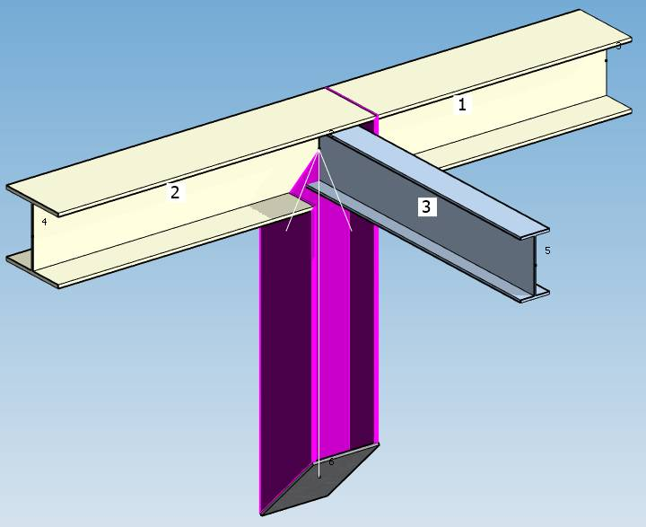

The direction of a selected beam is represented by a **white arrow** (Node1 to Node2).

All beams (not parallel to current one) of each extremity are numbered.

At extremity 1 (Node1), the numbers are drawn inside a **black** square.

At extremity 2 (Node2), the numbers are drawn inside a **white** square.

You can specify the beam with which you want a particular ending.

The **Offset** adds (or subtracts if negative value) an offset distance to the ending plane (parallel to the plane).

| Property | Unit Metric | Unit USA |
| -------- | ---- | ---- | 
| Offset | mm | in |

{: .warning }
>ATTENTION, the endings are only graphical and have no impact on the calculation. It helps for visualization and for the calculation of plate dimensions. In fact the beams do intersect at the node :

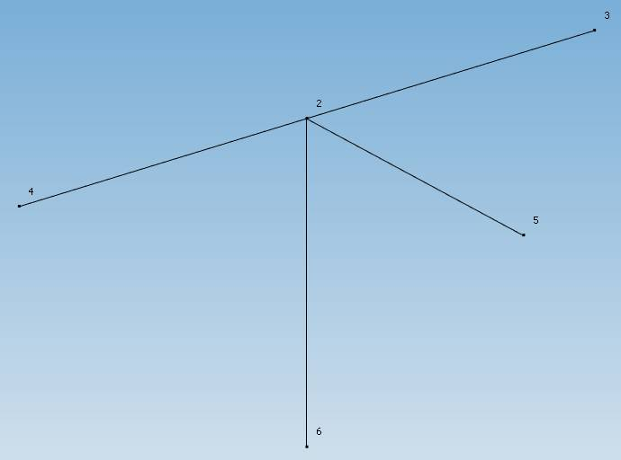

### 1.1 None ending

Ending plane = plane perpendicular to the current beam at the node :

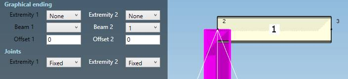

### 1.2 Front ending

Ending plane = nearest plane encountered at the specified beam :

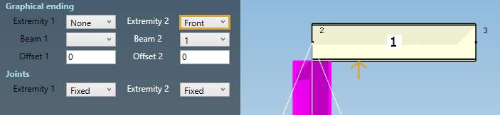

### 1.3 Back ending

Ending plane = furthest plane encountered at the specified beam :

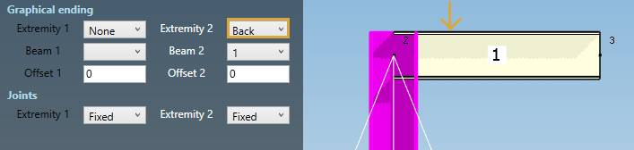

### 1.4 Miter ending

Ending plane = bisector plane between current beam and specified beam :

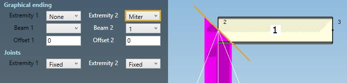

### 1.5 Plate ending

Ending plane = plane of the anchor plate.

An **anchor plate** must exists at the extremity node.

See §2. for an example of plate ending.

## 2. Examples

In this example, the selected beam has a **front** ending with beam 2 at its first extremity (black column):

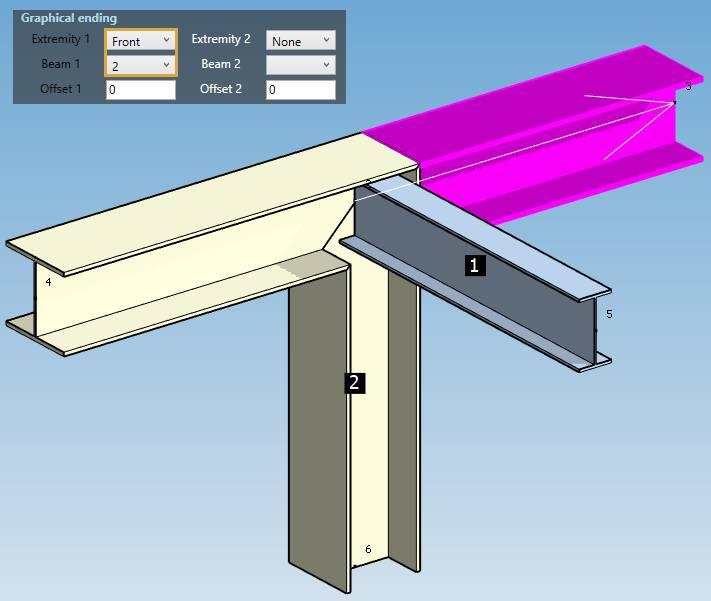

In this example, the selected beam has a **miter** ending with beam 2 at its first extremity (black column) :

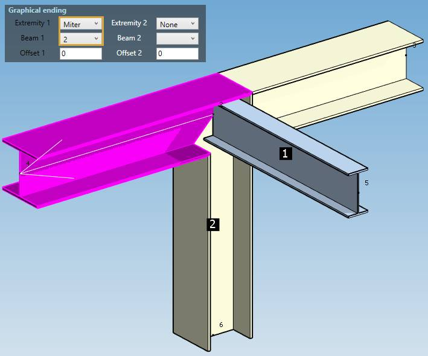

In this example, the selected beam has a **plate** ending at its first extremity (black column) and a **miter** ending with beam 2 at its second extremity (white column) :

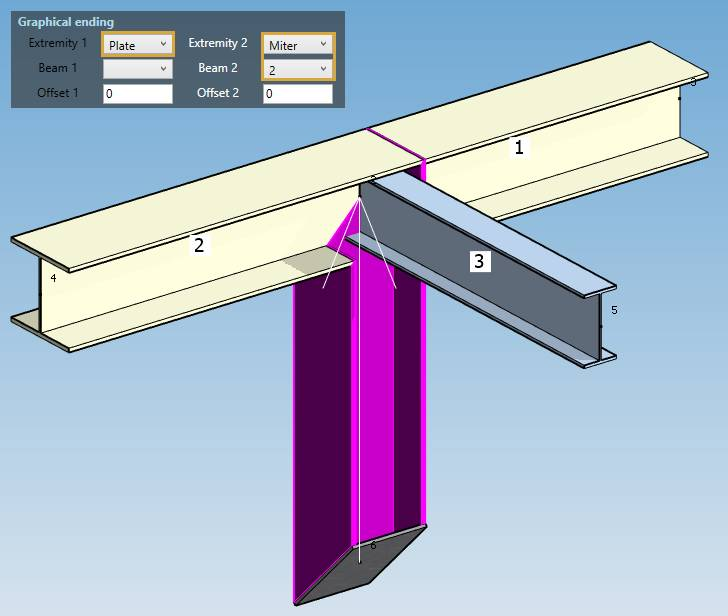

In this example, the selected beam has a **front** ending with beam 3 with an offset of 116 mm at its first extremity (black column) :

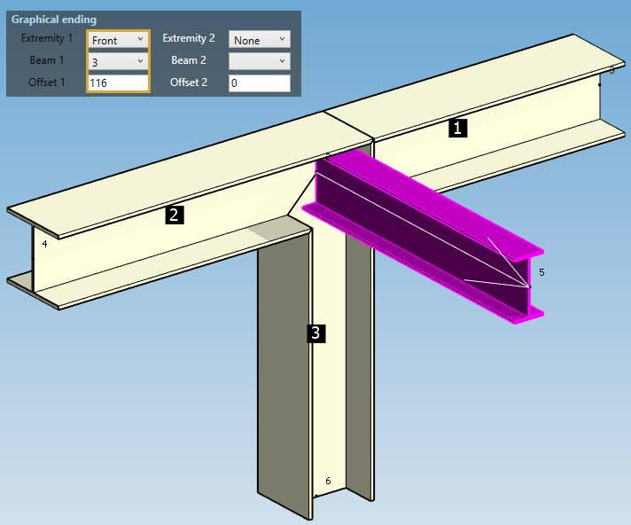

The **offset** corresponds to the distance from the first face encountered to the web = (240 - 7.5) / 2  = +/- 116 mm :

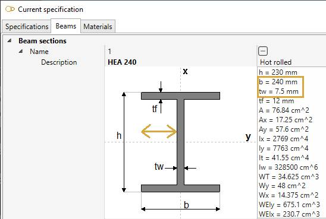

---

Click [here](https://documentation.metapiping.com/Structure/Elements/Beam/index.html) to return to **beam** page.