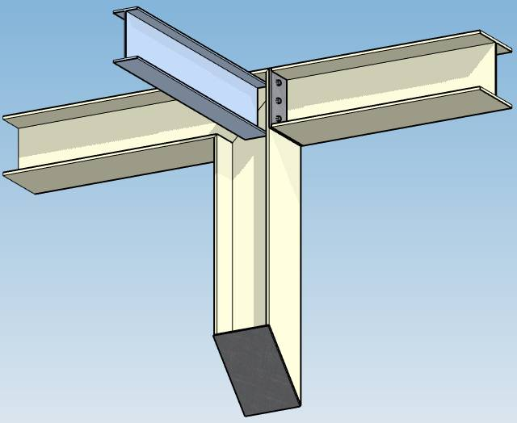

# Joint

MetaStructure proposes several **assemblies** for each extremity of a beam :

| Type | Description |
| -------- | ----------- |
| Fixed | Rigid joint (transmission of moments) |
| Detailed | User can specify the 3 translation stiffnesses and 3 rotation stiffnesses |
| Bolted | User can define a bolted joint |
| Welded | User can define a welded joint |

## 1. Definition

All joint types are at least defined by 6 stiffnesses :

| Property | Description | Unit Metric | Unit USA |
| -------- | ---- | ---- | ---- |
| Kx | Translation stiffness X | kN/mm | kips/in |
| Ky | Translation stiffness Y | kN/mm | kips/in |
| Kz | Translation stiffness Z | kN/mm | kips/in |
| Krx | Rotation stiffness X | kN.m/rad | kips.ft/rad |
| Kry | Rotation stiffness Y | kN.m/rad | kips.ft/rad |
| Krz | Rotation stiffness Z | kN.m/rad | kips.ft/rad |

### 1.1 Fixed joint

This is the default rigid connection.

*Example of fixed joint on extremity 1 (black side)*

| Property | Value (MKS units) |
| -------- | ---- |
| Kx, Ky, Kz | 1.75e13 |
| Krx, Kry, Krz | 1.13e12 |

If user wants to define other stiffnesses, he has to set the joint to **detailed**.

### 1.2 Detailed joint

This is the simplest joint where user can define the stiffnesses :

Press the **Edit** button and disable the transmission of the moments (stiffness = 0) around X and Y axis :

To see the local axis, press the **Show/Hide** button of **Local X-axis direction** :

{: .warning }
>Z-axis is always the axis of the beam in MetaStructure and X-axis is the **weak** axis.

### 1.3 Bolted joint

The assembly of a beam to another beam can be defined by a bolted plate :

Press the **Edit** button and set the plate properties :

Press **OK** to validate the bolted plate and press **Modify** to validate the beam :

**Stiffnesses** :

| Property | Description | Unit Metric | Unit USA |
| -------- | ---- | ---- | ---- |
| Kx | Translation stiffness X | kN/mm | kips/in |
| Ky | Translation stiffness Y | kN/mm | kips/in |
| Kz | Translation stiffness Z | kN/mm | kips/in |
| Krx | Rotation stiffness X | kN.m/rad | kips.ft/rad |
| Kry | Rotation stiffness Y | kN.m/rad | kips.ft/rad |
| Krz | Rotation stiffness Z | kN.m/rad | kips.ft/rad |

See §1.2 for more information.

**Plate** :

*Explanation of the fields on the picture :*

The plate receives the dimensions of the beam when created.

| Property | Description | Unit Metric | Unit USA |
| -------- | ---- | ---- | ---- |
| Width | Width of the plate | mm | in |
| Height | Height of the plate | mm | in |
| Thickness | Thickness of the plate | mm | in |
| Center X | Distance along X between center of plate and center of beam | mm | in |
| Center Y | Distance along Y between center of plate and center of beam | mm | in |

Click on the **...** button to select a *Structure* material :

Click [here](https://documentation.metapiping.com/Settings/Databases/Materials.html) for more information about database of materials.

**Bolt arrangement** :

*Explanation of the fields on the pictures :*

| Property | Unit Metric | Unit USA |
| -------- | ---- | ---- |
| Spacing | mm | in |
| Shift | mm | in |

**Bolt** :

Click on the **...** button to select a *Bolt* :

All properties are automatically filled.

Click [here](https://documentation.metapiping.com/Settings/Databases/Bolts.html) for more information about database of bolts.

| Property | Unit Metric | Unit USA |
| -------- | ---- | ---- |
| Diameter | mm | in |
| Pitch | mm | in |
| Resistant are | mm² | in² |

Click on the **...** button to select a *Bolting* material :

Click [here](https://documentation.metapiping.com/Settings/Databases/Materials.html) for more information about database of materials.

### 1.4 Welded joint

The assembly of a beam on another beam can be defined by welding :

Press the **Edit** button and set the weld properties :

Press **OK** to validate the welding and press **Modify** to validate the beam :

**Stiffnesses** :

| Property | Description | Unit Metric | Unit USA |
| -------- | ---- | ---- | ---- |
| Kx | Translation stiffness X | kN/mm | kips/in |
| Ky | Translation stiffness Y | kN/mm | kips/in |
| Kz | Translation stiffness Z | kN/mm | kips/in |
| Krx | Rotation stiffness X | kN.m/rad | kips.ft/rad |
| Kry | Rotation stiffness Y | kN.m/rad | kips.ft/rad |
| Krz | Rotation stiffness Z | kN.m/rad | kips.ft/rad |

See §1.2 for more information.

**Weld** :

| Property | Description | Unit Metric | Unit USA |
| -------- | ---- | ---- | ---- |
| Flange throat | Apothem of the bead | mm | in |

Click on the **...** button to select a *Welding* material :

Click [here](https://documentation.metapiping.com/Settings/Databases/Materials.html) for more information about database of materials.

### 1.5 Duplicate joint

The definition of a **joint** (fixed, detailed, bolted or welded) can be copied and pasted to the extremity of any beams :

{: .warning }
>Don't forget to click to the **Modify** button to validate the duplication and see the result in 3D !

---

Click [here](https://documentation.metapiping.com/Structure/Elements/Beam/index.html) to return to **beam** page.