# Draw structure

## 1. New project

Select a current **section**.

Click on the **Draw structure** button :

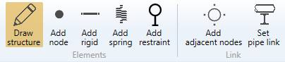

As we start the modelisation, we need to create a **First node** :

Click [here](https://documentation.metapiping.com/Structure/Elements/Node.html) for more information about the **First node** creation.

### 1.2. Draw the first beam

After the first node has been created, you can draw your first beam :

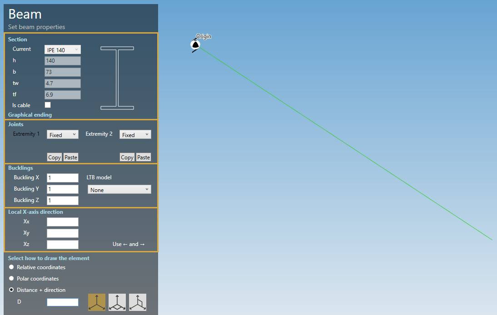

The current **section** is the selected one in the upper **specification** ribbon.

Some properties are shown :

| Property | Description | Unit Metric | Unit USA |
| -------- | ----------- | ---- | ---- |
| h | Height | mm | in |
| b | Basis | mm | in |
| tw | Web thickness | mm | in |
| tw | Flange thickness | mm | in |

    To know the UNIT of the value, just let the mouse over the cell. 

You can define the joints, the bucklings and the local-X axis direction. See below.

The only thing you have to do is to select how to draw the pipe.

Click [here](https://documentation.metapiping.com/Design/Elements/Orientation.html) for more information about the orientation tool.

## 2. Draw structure

When you click on the **Draw structure** button without selection, the left panel shows a message :

    Select a node

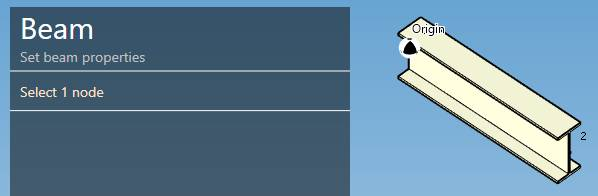

The **selection mode** is automatically set to **POINT**. You can so directly select a node.

### 2.1 Intermediate node

You can start a new beam on an intermediate point on the beam under mouse :

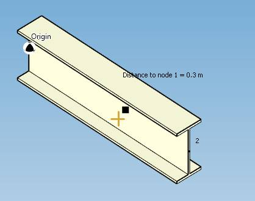

Once the distance from the first node of the beam is correct, **CLICK** on the left mouse button.

MetaStructure will automatically cut the beam and start a new beam from this new node :

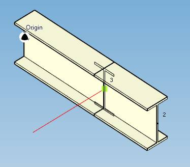

If you want to start from an extremity, be carreful to have the extremity node in **MAGENTA** :

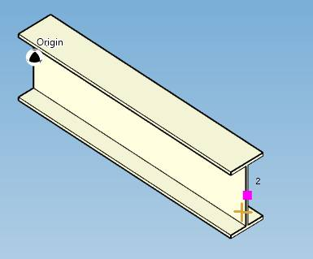

### 2.2 End of beam

You can trace a beam in different way :

* With the **orientation tool** :

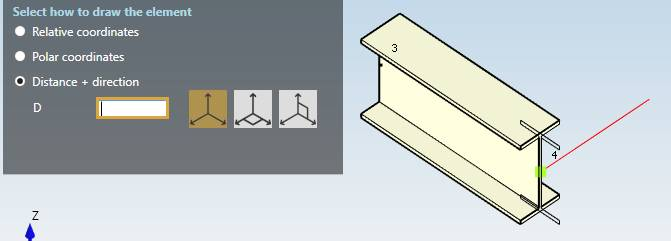

Choose a direction and write the **Length** with the numpad of the keyboard and press **Enter** to create the beam.

Click [here](https://documentation.metapiping.com/Design/Elements/Orientation.html) for more information about the orientation tool.

* That end on an **existing node** :

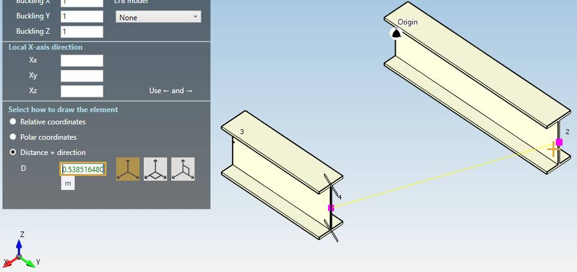

The node must be in **MAGENTA** color. The distance is automatically set in the cell. Just press **Enter** to create the beam.

* That end on a projection X/Y/Z of a **Reference node** (in green) :

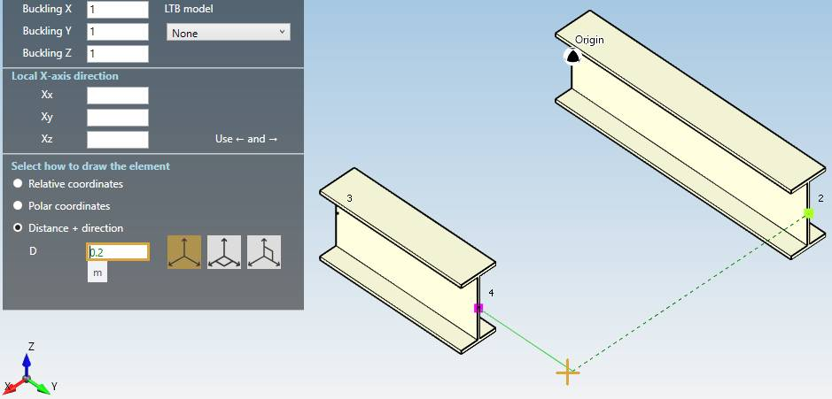

To define a **Reference point**, just move the mouse near an existing node -> it comes green.

The distance is automatically set in the cell. Just press **Enter** to create the beam.

* That end on an **intermediate node** :

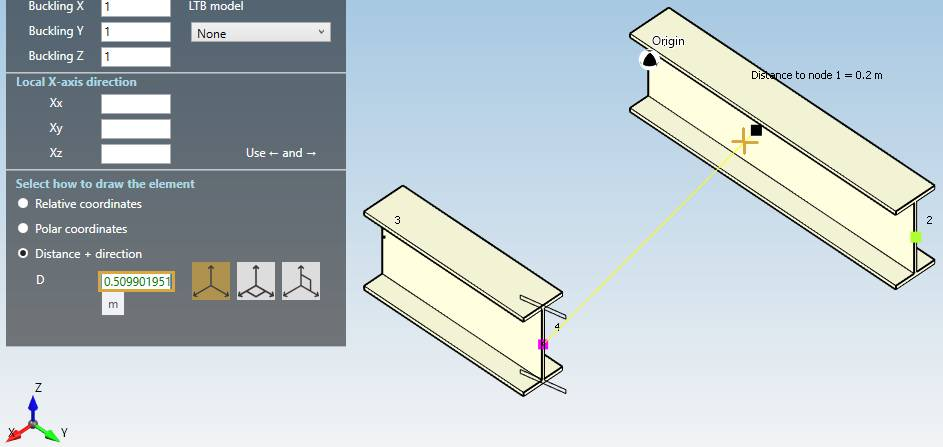

The distance is automatically set in the cell. Just press **Enter** to create the beam.

MetaStructure will automatically cut the beam

* That end **perpendicular** to another beam :

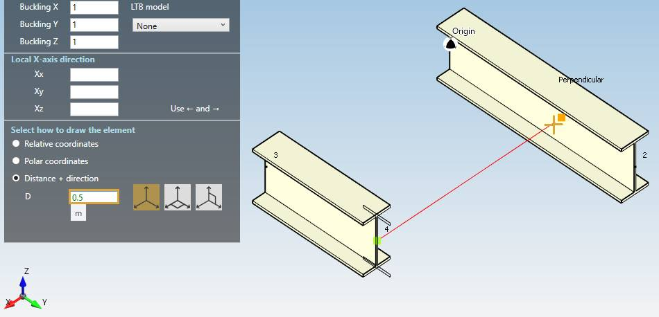

The distance is automatically set in the cell. Just press **Enter** to create the beam.

MetaStructure will automatically cut the beam

## 3. Graphical ending

## 4. Joints

## 5. Bucklings

## 6. Local X-axis direction

The default local-X direction for a beam is :

* (0, 1, 0) for vertical beams
* (0, 0, 1) for non vertical beams

During modelisation, you can set the values or press **-->** or **<--** to rotate the section by 90° :

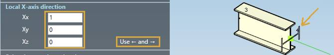

The section is directly drawn as a preview.

When selecting a beam, you can **Show/Hide** the local X-axis direction and modify it :

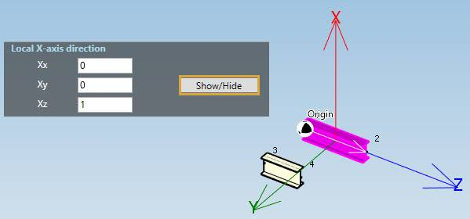