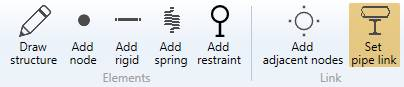
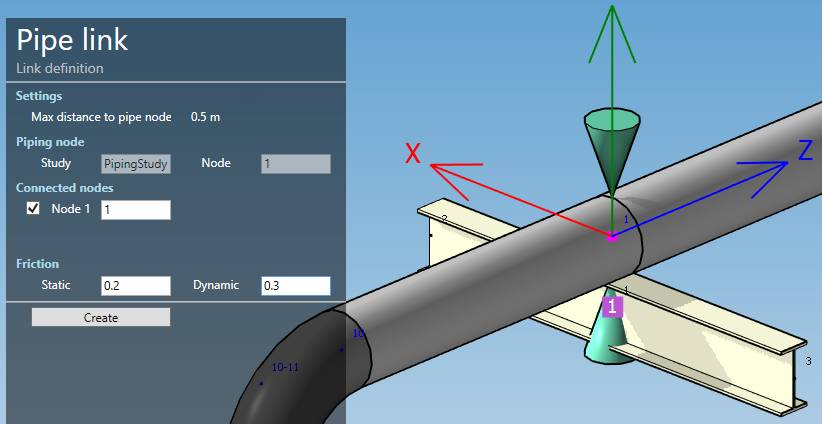
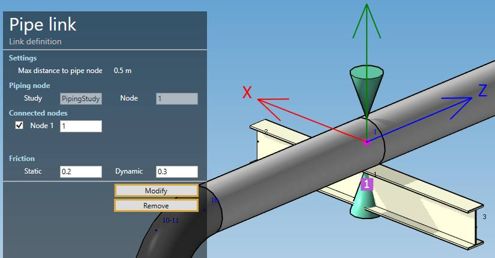

# Pipe link

This tool create a **Link** between one **piping** node and multiple **structure** nodes.

>This link is necessary for load definition (External load) and during analysis.

When you click on the **Set pipe link** button without selection, the left panel shows a message :

The **selection mode** is automatically set to **POINT**. You can so directly select a node.

## 1. Create a link

Select a piping node with a restraint and beam nodes around :

MetaStructure looks for all beam nodes around the selected pipe node at a distance smaller than a default one (0.5 m in this example) and perpendicular to the pipe direction.

Click [here](https://documentation.metapiping.com/Settings/General.html#7-structure) for more information about the settings.

It shows also the linked study name (PipingStudy) and the piping node name (1).

In this example, MetaStructure detects only one connected node :

    Node 1 = 1

You can uncheck some connected nodes or change the node name.

Finally, you can set a static and dynamic friction factor.

Click on the **Create button** to create a new link.

You can **undo** this command.

## 2. Modify/remove a link

Select a piping node with a link :

Change some properties and click on the **Modify** button or delete it by clicking the **Remove** button.

You can **undo** this command.

## 3. U-bolts

MetaStructure check the restraints on the piping node. If it is a completely blocked restraint or blocked only perpendicular to the pipe, a U-bolt checkbox will appears :

Check it in order to select an appropriate U-bolt in database.

Only U-bolts with the size of the pipe (tolerance 1 mm) and the restraint type (fixed or guide) will be proposed.

Select a library, a U-bolt and click **OK**.

The name of the U-bolt appears. You can modify the link by pressing the **Modify** button :

The U-bolt will appear :

