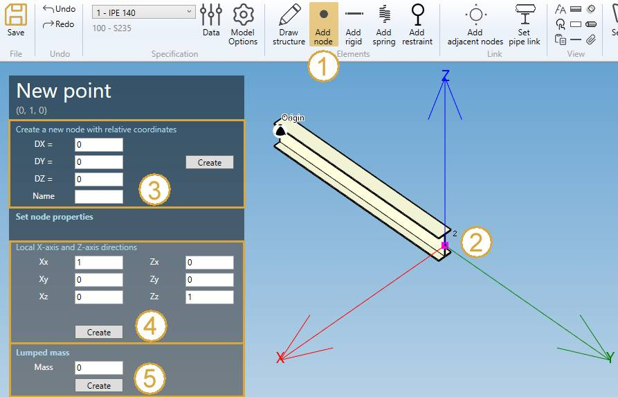

# Create nodes

There are 3 possibilities of creation :

- Creation of the **FIRST** node
- Creation of a **GLOBAL** node
- Creation of a **RELATIVE** node

## 1. First node

The first node panel is called when a first **beam** needs a starting point.

Select a **section** and click on **Draw structure**, the **Add node** button is automatically selected :

Set the **GLOBAL** X, Y, Z coordinates and a name.

See **Global node** just below :

## 2. Global node

If the selection is **EMPTY**, click on the **Add node** button to create a new global node.

You can **Undo** this command.

Fill the **GLOBAL** X, Y, Z coordinates and a name.

| Property | Description | Unit Metric | Unit USA |
| -------- | ----------- | ---- | ---- |
| X | X global coordinate | m | ft |
| Y | Y global coordinate  | m | ft |
| Z | Z global coordinate  | m | ft |
| Name | Text or number | - | - |

    To know the UNIT of the value, just let the mouse over the cell. 

If **Name** is blanck, the new node will receive an automatic name based on the **Node settings**.

Click [here](https://documentation.metapiping.com/Settings/General.html) for more information about node naming.

---

## 3. Relative node

If a node is selected, you can create a new node relative to it in **Global directions** :

1. Click on **Add node** button
2. Select a **node**.
3. Define the DX, DY, DZ, name of the new node.
4. Click on **Create**

You can **Undo** this command.

Click [here](https://documentation.metapiping.com/Structure/Selection.html) for more information about the selection tool.

| Property | Description | Unit Metric | Unit USA |
| -------- | ----------- | ---- | ---- |
| DX | Relative distance from the selected node in X global direction | m | ft |
| DY | Relative distance from the selected node in Y global direction  | m | ft |
| DZ | Relative distance from the selected node in Z global direction  | m | ft |
| Name | Text or number | - | - |

If **Name** is blanck, the new node will receive an automatic name based on the **Node settings**.

Click [here](https://documentation.metapiping.com/Settings/General.html) for more information about node naming.

---

## 4. Creation of a local coordinate system

You can define a new **local coordinate system** on selected node (4).

1. Click on **Select point** button
2. Select a **node**
3. Define the local coordinate system
4. Click on **Create**

Just define the new **X** axis vector (Xx, Xy, Xz) in global coordinates and the new **Z** axis vector (Zx, Zy, Zz).
The **Y** axis will be automatically defined.

| Property | Unit Metric | Unit USA |
| -------- | ---- | ---- |
| Xx |  m | ft |
| Xy |  m | ft |
| Xz |  m | ft |
| Zx |  m | ft |
| Zy |  m | ft |
| Zz |  m | ft |

By default, the local coordinate system is equal to the global coordinate system.

Example :

Change the X direction = axis of the beam and Z direction unchanged :

Click on **Create** button.

You can **Undo** this command.

---

## 5. Creation of a lumped mass

You can define a **lumped mass** on selected node (5) :

| Property | Unit Metric | Unit USA |
| -------- | ---- | ---- |
| Mass | ton | kips |

Click on the **Create** button to add a new lumped mass to the node.

You can later modify or remove this object by selecting this node and click on **Modify/Remove** buttons.

You can **Undo** this command.

## 6. Modify a node

Change the **Selection mode** to POINT and select a node. Only the **Name** can be changed.

You can **Undo** this command.