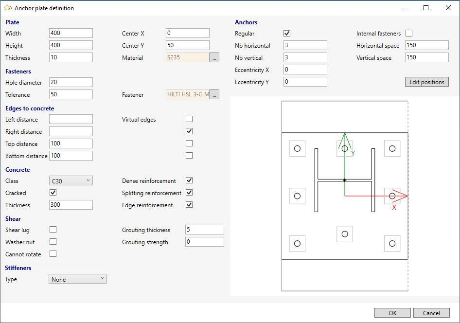
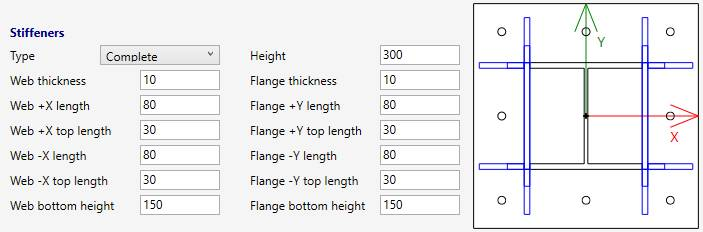

# Restraint

Click on the **Add restraint** button :

Without selection, the left panel shows a message :

    Select a node

The **selection mode** is automatically set to **POINT**. You can so directly select a node.

## 1. Anchor

MetaStructure lets you only create anchors :

| Property | Description | Unit Metric | Unit USA |
| -------- | ----------- | ---- | ---- |
| Label | Label of the restraint | - | - |
| Kx | Spring Constant acting in X direction | kN/mm | Kips/in |
| Ky | Spring Constant acting in Y direction | kN/mm | Kips/in |
| Kz | Spring Constant acting in Z direction | kN/mm | Kips/in |
| KΘx | Rotational Spring Constant acting in X direction | kN.m/rad | Kips.ft/rad |
| KΘy | Rotational Spring Constant acting in Y direction | kN.m/rad | Kips.ft/rad |
| KΘz | Rotational Spring Constant acting in Z direction | kN.m/rad | Kips.ft/rad |  

    To know the UNIT of the value, just move the mouse over the cell. 

>The labels are shown with the node names view button.

You can change the coordinate system that defines the directions X,Y,Z :

- Global (default)
- Local to adjacent element coordinate system
- Local to the node coordinate system (if exists on node)

Click [here](https://documentation.metapiping.com/Structure/Elements/Node.html#4-creation-of-a-local-coordinate-system) for more information about new coordinate system on node.

The **Level** is used to identify the spectrum applied to this anchor for multilevel floor response spectrum analysis.

Set the coordinate system to **Local to adjacent element** and click the **Create** button to create an anchor :

>If one or more **spring constants** are unchecked, the symbol of the anchor is changed from a box to a disk :

You can **Undo** this command.

You can later modify or remove this anchor by selecting it and clicking on **Modify/Remove** buttons.

# 2. Anchor plate

Set the coordinate system to **Local to adjacent element** and check the **Anchor plate** cell :

Press the **Edit** button and set the plate properties :

{: .warning }
>Pay close attention to the axes ! The profile is rotated on the preview to match the X-axis of the plate !

Press **OK** to validate the anchor plate and press **Create** to validate the restraint :

The resulting anchor plate is rotated to correspond to the actual X-axis of the beam ! The plate is perfectly represented with its thickness and bolts. The grouting is represented under the plate with its thickness. The concrete is represented with its dimensions and dashed lines and crosses on virtual edges.

## 2.1 Plate definition

Define the plate geometry and material :

*Explanation of the fields on the picture :*

| Property | Description | Unit Metric | Unit USA |
| -------- | ---- | ---- | ---- |
| Width | Width of the plate | mm | in |
| Height | Height of the plate | mm | in |
| Thickness | Thickness of the plate | mm | in |
| Center X | Distance along X between center of plate and center of beam | mm | in |
| Center Y | Distance along Y between center of plate and center of beam | mm | in |

Click on the **...** button to select a *Structure* material :

Click [here](https://documentation.metapiping.com/Settings/Databases/Materials.html) for more information about database of materials.

## 2.2 Fastener definition

Define the type of fastener :

*Explanation of the fields on the picture :*

| Property | Description | Unit Metric | Unit USA |
| -------- | ---- | ---- | ---- |
| Hole diameter | Diameter of the hole | mm | in |
| Tolerance | Anchor drilling area (uncertainty square side) | mm | in |

Click on the **...** button to select a *Fastener* :

Click [here](https://documentation.metapiping.com/Settings/Databases/Fasteners.html) for more information about database of fasteners.

## 2.3 Anchor definition

Define the fastener arrangement :

*Explanation of the fields on the picture :*

| Property | Description | Unit Metric | Unit USA |
| -------- | ---- | ---- | ---- |
| Space | Distance between 2 fasteners | mm | in |
| Eccentricity | Offset between center of plate and center of fasteners | mm | in |

The **Regular** checkbox means that the fasteners are considered to be placed in a regular grid (even if there are small deviations), and are thus subject to regulatory checks.

The **Internal fasteners** checkbox adds internal fasteners inside the grid.

You have also the possibility to edit the position of every fastener and assign a reasonable offset in the case of quasi-regular configurations, subject to regulatory verifications :

*Select a row and change the X, Y values*

    To know the UNIT of a property, just let the mouse over the property name. 

| Property | Unit Metric | Unit USA |
| -------- | ---- | ---- |
| X | mm | in |
| Y | mm | in |

## 2.4 Edges to concrete definition

Define the distance between the plate and the free border of the concrete :

Blank value means that the plate is at an infinite distance from the free border of the concrete.

When a free edge is present, the fasteners are checked with additional failure modes : failure by splitting (tension) and edge failure (shear).

The **Virtual edges** checkboxes let you take account of the interaction between neighboring plates if they are too close to each other. 

*Explanation of the fields on the picture :*

| Property | Unit Metric | Unit USA |
| -------- | ---- | ---- |
| Distance | mm | in |

## 2.5 Concrete definition

Define the concrete properties :

Choose between C20, C25, C30, C35, C40, C45, C50, C55, C60 classes, cracked or not, with or without reinforcements (dense, splitting, edge).

| Property | Unit Metric | Unit USA |
| -------- | ---- | ---- |
| Thickness | mm | in |

## 2.6 Shear and grouting definition

| Property | Unit Metric | Unit USA |
| -------- | ---- | ---- |
| Thickness | mm | in |
| Strength | N/mm² | ksi |

Grouting: enter the thickness and strength of the mortar if leveling is planned. To model an anchor with spacing but no mortar, it suffices to define the thickness of the mortar equal to the spacing and the resistance equal to 0.

The **Shear lug** checkbox means that all the shear forces are assumed to be taken up by the lug. Only the bending moments and the normal force acting on the plate are considered for the calculation of the fasteners. 

The **Washer nut** checkbox means that the bending moment in the anchor induced by shear can be reduced if a washer and a nut are directly attached to the concrete surface (in case of non-null grouting thickness).

The **Cannot rotate** checkbox means that the anchor plate is assumed to be free to rotate.

## 2.7 Stiffeners

Define stiffeners to reinforce the plate :

Types :

* None
* Web
* Flange
* WebFlange
* Special (only for channel and I)
* Complete (only for channel and I)

You can define the thickness, heights and the lengths of the stiffeners in both sides.

| Property | Unit Metric | Unit USA |
| -------- | ---- | ---- |
| Length, height and thickness | mm | in |

The axis are depending on the defined coordinate system :

- Global (default)
- Local to adjacent element coordinate system
- Local to the node coordinate system (if exists on node)

{: .warning }
>The definition of stiffeners is only useful for **finite element analysis** !

Click [here](https://documentation.metapiping.com/Analysis/FEA/AnchorPlate.html) for more information about *Finite Element Analysis* of anchor plates.

### 2.7.1 Web

The stiffeners are aligned with the web of the profile :

*X,Y axis based on local to adjacent element coordinate system in the picture*

### 2.7.2 Flange

The stiffeners are aligned with the flanges of the profile :

*X,Y axis based on local to adjacent element coordinate system in the picture*

### 2.7.3 Web + Flange

The stiffeners are aligned with the web and the flanges of the profile :

*X,Y axis based on local to adjacent element coordinate system in the picture*

### 2.7.4 Special (only for channel and I profile)

The stiffeners close the profile with a plate :

*X,Y axis based on local to adjacent element coordinate system in the picture*

### 2.7.5 Complete (only for channel and I profile)

A combination of *Special* and *Flange* stiffeners :

*X,Y axis based on local to adjacent element coordinate system in the picture*

## 2.8 Anchor plate duplication

The definition of an **anchor plate** can be copied and pasted to another restraint :

*Copy the anchor plate from the selected restraint*

*Press Add restraint, select a node with a beam (1), change coordinate system to "Local to adjacent element" (2), check "Anchor plate" (3), click on "Paste" (4) and finally click on "Create" :*

{: .warning }
>ATTENTION, unlike the previous preview of the plate, this new one show the beam in dashed lines. This means that the preview is looking in opposite direction (from outside -> concrete -> plate -> beam) :

## 2.9 User defined local coordinate system

It is also possible to create an anchor plate that follows user defined local coordinate system.

**Example :**

Select the node where the anchor plate will be placed and create a local coordinate system :

{: .warning }
>Set the X-axis equal to the beam X-axis (vertical in this example)

*Press Add restraint, select a node with a beam (1), change coordinate system to "Local to node coordinate system" (2), check "Anchor plate" (3), click on "Paste" (4) and finally click on "Create" :*

For better visual result, select the beam and change the first graphical ending to **Plate** :

Click on the **Modify** button :

Click [here](https://documentation.metapiping.com/Structure/Elements/Beam/Ending.html) for more information about the graphical endings.
