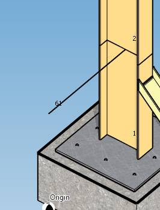

# Rigid

    A rigid is a straight element sufficiently stiff to rigidly transmit all deflections and rotations.

When you click on the **Add rigid** button without selection, the left panel shows a message :

    Select 1 node

The **selection mode** is automatically set to **POINT**. You can so directly select a node.

## 1. Create a rigid

- Select a **node**.
- Click the **Add rigid** button.

| Property | Unit Metric | Unit USA |
| -------- | ---- | ---- |
| Length | m | ft |
| Mass | ton | kips |

>The length must be defined by the **orientation tool**.

Set the default material of the rigid.

You can define the **Local X-axis** vector by defining Xx, Xy, Xz in global coordinates.

You can then define the second point of the rigid thanks to the **Orientation tool**.

Click [here](https://documentation.metapiping.com/Design/Elements/Orientation.html) for more information about the orientation tool.

Create the rigid (represented by a black line) :

You can **undo** this command.

## 2. Modify/Remove a rigid

    A rigid can also be used to simulate an eccentricity between beams.

*Select a rigid, change some properties and click on the **Modify** button or delete the rigid by clicking the **Remove** button.*

You can **undo** this command.