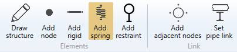
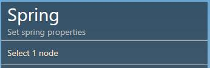
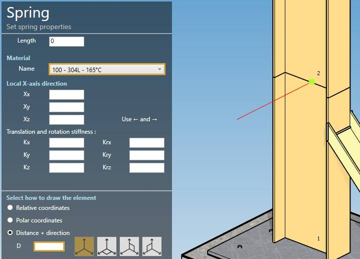
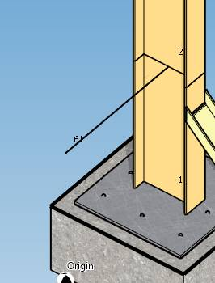

# Spring

When you click on the **Add spring** button without selection, the left panel shows a message :

The **selection mode** is automatically set to **POINT**. You can so directly select a node.

## 1. Create a spring

- Select a **node**.
- Click the **Add spring** button.

>The length must be defined by the **orientation tool**.

Click [here](https://documentation.metapiping.com/Design/Elements/Orientation.html) for more information about the orientation tool.

Set the default material of the spring.

You can define the **Local X-axis** vector by defining Xx, Xy, Xz in global coordinates.

**Stiffnesses :**

| Property | Description | Unit Metric | Unit USA |
| -------- | --- | ---- | ---- |
| Length | - | m | ft |
| Kx | Translation stiffness in X direction | kN/mm | kips/in |
| Kx | Translation stiffness in Y direction | kN/mm | kips/in |
| Kx | Translation stiffness in Z direction | kN/mm | kips/in |
| Krx | Rotation stiffness in X direction | kN.m/rad | kips.ft/rad |
| Kry | Rotation stiffness in Y direction | kN.m/rad | kips.ft/rad |
| Krz | Rotation stiffness in Z direction | kN.m/rad | kips.ft/rad |

Blank values mean that the corresponding degrees of freedom are blocked.

You can then define the second point of the spring thanks to the **Orientation tool**.

Create the spring (represented by a black line) :

You can **undo** this command.

## 2. Modify/Remove a spring

Select a spring, change some properties and click on the **Modify** button or delete it by clicking the **Remove** button.

You can **undo** this command.