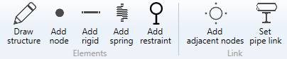

# Elements and link

## 1. Elements

MetaStructure proposes several tools to build **structures** :

* Draw structure (beam)
* Add node
* Add rigid
* Add spring
* Add restraint

## 2. Link

MetaStructure proposes a tool to faciltate the creation of nodes based on piping nodes :

* Add adjacent nodes

And a tool to make a *connection* between piping nodes and structure nodes :

* Set pipe link
