# Grid edition

MetaStructure lets you create (and modify) the current structure by defining the nodes, the elements and the restraints in a grid way :

## 1. Nodes

Select the **Nodes** tab.

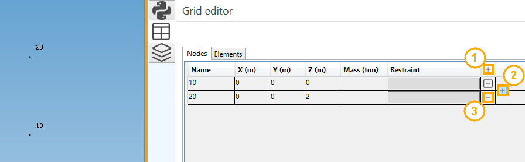

Editing buttons :

1. Add a new node
2. Insert a new node between 2 existing nodes
3. Remove an isolated node (not an extremity of an element)

REM : Place the mouse at the position shown on the upper picture to display the button 2.

### 1.1 Node properties

| Property | Description | Unit Metric | Unit USA |
| -------- | ----------- | ---- | ---- |
| Name | Text or number, unic (1) | - | - |
| X | X global coordinate | m | ft |
| Y | Y global coordinate | m | ft |
| Z | Z global coordinate | m | ft |
| Mass | Lumped mass | ton | kips |

(1) New node will receive an automatic name based on the **Node settings**.

Click [here](https://documentation.metapiping.com/Settings/General.html) for more information about node naming.

### 1.2 Restraints

A *restraint* (anchor or anchor plate) can be defined on node as soon as an element exists on that node.

See §3. for restraint definition.

## 2. Elements

Select the **Elements** tab.

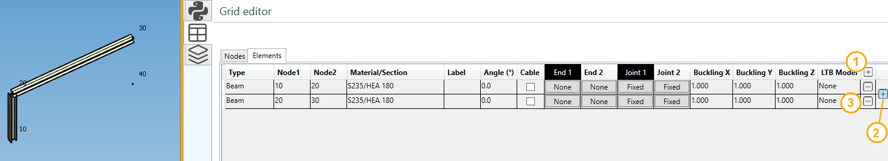

Editing buttons :

1. Add a new element
2. Insert a new element between 2 existing elements
3. Remove an element

REM : Place the mouse at the position shown on the upper picture to display the button 2.

### 2.1 Add/insert an element

Click on button 1 or 2. A window appears :

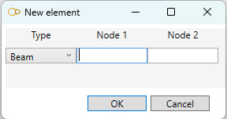

- Select the type : beam, rigid, spring or matrix
- Select the first node name
- Select the last node name

REM : the node names must exist.

### 2.2 Element properties

| Property | Description | Remark |
| -------- | ----------- | --- |
| Type | beam, rigid, spring or matrix |  |
| Node1 | First extremity node name |  |
| Node2 | Last extremity node name |  |
| Material/Section | Material & section for beams, material for rigid, spring and matrix |  |
| Label | Label of the element |  |
| Angle | Angle of rotation around element axis | Only for beam |
| Cable | True or false | Only for beam |
| Buckling X | buckling factor in the **weak** inertia plane | Only for beam |
| Buckling Y | buckling factor in the **strong** inertia plane | Only for beam |
| Buckling Z | the **lateral-torsional** buckling factor | Only for beam |
| LTB Model | Lateral-Torsional Buckling model | Only for beam |

The **Lateral-Torsional Buckling** model (LTB) must be defined for the calculation of the elastic critical moment according to Eurocode 3.

This critical moment depends on the coefficients C1 and C2 :

### 2.3 Graphical ending

The extremities of a selected beam can be mofified.

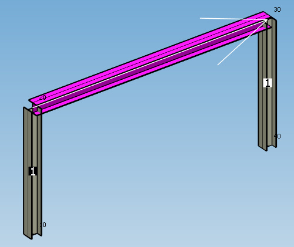

The beams connected to the first extremity are numbered in a black square.

The beams connected to the last extremity are numbered in a white square.

Click on the button of the correct extremity (black or white column) to modify the graphical ending :

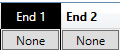

Set the properties of the selected ending :

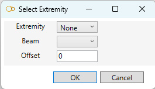

The extremity can be :

- None
- Front
- Back
- Miter

Click [here](https://documentation.metapiping.com/Structure/Elements/Beam/Ending.html) for more information about graphical ending.

### 2.4 Joint

The joints of a selected beam can be mofified.

The beams connected to the first extremity are numbered in a black square.

The beams connected to the last extremity are numbered in a white square.

Click on the button of the correct extremity (black or white column) to modify the joint :

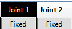

Choose a joint type :

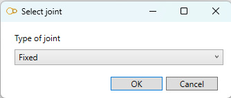

| Type | Description |
| -------- | ----------- |
| Fixed | Rigid joint (transmission of moments) |
| Detailed | User can specify the 3 translation stiffnesses and 3 rotation stiffnesses |
| Bolted | User can define a bolted joint |
| Welded | User can define a welded joint |

Click [here](https://documentation.metapiping.com/Structure/Elements/Beam/Joint.html) for more information about beam joints.

## 3. Restraints

Select the **Nodes** tab.

Click on the *restraint* button on the desired node :

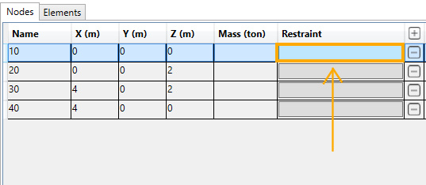

REM : an element must exists at that node.

The *restraint* edition panel opens :

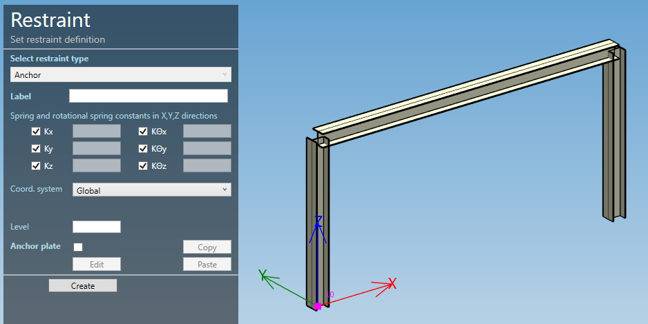

Click [here](https://documentation.metapiping.com/Structure/Elements/Restraint.html) for more information about restraint definition.

After the definition of a restraint on node, the button appears with a title (Anchor plate in this example) :

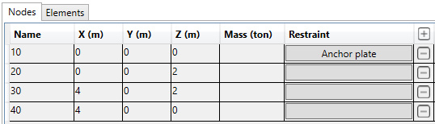