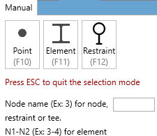

# Modification

## 1. Selection

Click on **Select** button to open the selection window :

- Click on **Point** to select nodes (or F10)
- Click on **Element** to select elements (beam, rigid and spring) (or F11)
- Click on **Restraint** to select restraints (or F12)
- Press **ESC** on keyboard to hide the selection window

You can now select objects of the corresponding type.

    The selection is done by pressing the left mouse button above the desired object

Click [here](https://documentation.metapiping.com/Structure/Selection.html) to have more information about the selection.

## 2. Measure tool

See [Mesure tool in Review](https://documentation.metapiping.com/Review/Piping.html#4-measure-tool) for more info.

## 3. Remove elements

Select elements and click the **Remove elements** button to delete these elements.

You can **Undo** this command.

## 4. Cut beams

When you click on the **Cut beams** button without selection, the left panel shows a message :

The **selection mode** is automatically set to **ELEMENT**. You can so directly select a beam.

Cut mode can be :
* Cut into 2 parts
* Cut into N parts

The current length of the beam is shown on top.

By default, a distance from the first node of the beam is calculated, which is the half length of the selected beam (middle point).

You can choose from which node to start and the distance.

| Property | Unit Metric | Unit USA |
| -------- | ---- | ---- |
| Length | m | ft |
| Distance | m | ft |

Click on **Cut** to execute the command.

    To know the UNIT of the value, just let the mouse over the cell. 

You can **Undo** this command.

The second possibility is to cut in N parts with preview :

Click on the **Cut** button :

You can **Undo** this command.

## 5. Merge beams

Select a **Node** between 2 similar colinear beams and click the **Merge** button.

The 2 beams must have the same **Material** and the same **Section**.

The 2 beams will be replaced by one beam.

{: .warning }
>Attention, the force, restraint, lumped mass or local coordinates defined on the node will be destroyed.

You can **Undo** this command.

## 6. Move nodes

When you click on the **Move nodes** button without selection, the left panel shows a message :

The **selection mode** is automatically set to **POINT**. You can so directly select nodes.

Select the nodes one by one (with CTRL) or by a selection rectangle :

Set the offset to apply to the selected nodes :

| Property | Unit Metric | Unit USA |
| -------- | ---- | ---- |
| DX | m | ft |
| DY | m | ft |
| DZ | m | ft |

Validate the command by clicking the **Move** button :

You can **Undo** this command.

## 7. Change length/direction

When you click on the **Change length** button without selection, the left panel shows a message :

The **selection mode** is automatically set to **ELEMENT**. You can so directly select an element (beam, rigid or spring).

Change mode :

* Change length
* Change direction

You can select only one element.

### 7.1 Change length

Select an element and set the new length :

| Property | Unit Metric | Unit USA |
| -------- | ---- | ---- |
| Length | m | ft |

Set the new length to 1 and uncheck the **Shift** cell.

Click on the **Modify** button :

The point **55** moved.

>The graphical ending of the "green" beam and the welding have been automatically recalculated !

You can **Undo** this command.

### 7.2 Change direction

Select an element and set the mode **Direction** :

*The panel shows the actual DX, DY, DZ*

Set the new direction (DX, DY, DZ) and uncheck the **Shift** cell :

Click on the **Modify** button :

The point **52** moved.

>The graphical ending of the "green" beam and the welding have been automatically recalculated !

You can **Undo** this command.

## 8. Copy elements

MetaStructure lets you copy elements (without the load).

Copy mode :

* Translation
* Rotation
* Mirror

{: .warning }
>ATTENTION, MetaStructure do not check the position of the new nodes. Under no circumstances can they coincide with existing nodes.

### 8.1 Translation

Select the elements and define the translation vector :

| Property | Unit Metric | Unit USA |
| -------- | ---- | ---- |
| DX | m | ft |
| DY | m | ft |
| DZ | m | ft |

Set the number of repetition of the copy (default = 1).

{: .warning }
>ATTENTION, the restraints, node and element properties, DLCS, lump masses will also be copied but not the loads on the elements or nodes.

A preview shows where the copy will take place.

Click on the **Copy** button :

### 8.2 Rotation

Select the elements, define the position of the global center of rotation, the axis and the angle :

| Property | Unit Metric | Unit USA |
| -------- | ---- | ---- |
| XC | m | ft |
| YC | m | ft |
| ZC | m | ft |
| Angle | °| ° |

Set the number of repetition of the copy (default = 1).

{: .warning }
>ATTENTION, the restraints, node and element properties, DLCS, lump masses will also be copied but not the loads on the elements or nodes.

A preview shows where the copy will take place.

Click on the **Copy** button :

### 8.3 Mirror

Select the elements, define the position of a global point of the mirror plane and the plane normal :

| Property | Unit Metric | Unit USA |
| -------- | ---- | ---- |
| XP | m | ft |
| YP | m | ft |
| ZP | m | ft |

{: .warning }
>ATTENTION, the restraints, node and element properties, DLCS, lump masses will also be copied but not the loads on the elements or nodes.

A preview shows where the copy will take place.

Click on the **Copy** button :

## 9. Properties

### 9.1 Section

As in review, the **Section** property shows all sections used in the model with a colored map :

MetaStructure let you change the section of multiple elements in one operation.

Select multiple elements, a section, and click on the **Modify** button :

You can **Undo** this command.

Remarks :

>The section proposed are those from **Data** screen.

>If the sections are different between several selected elements, **Variable** will appear. You have to specify the wanted new section to be able to modify.