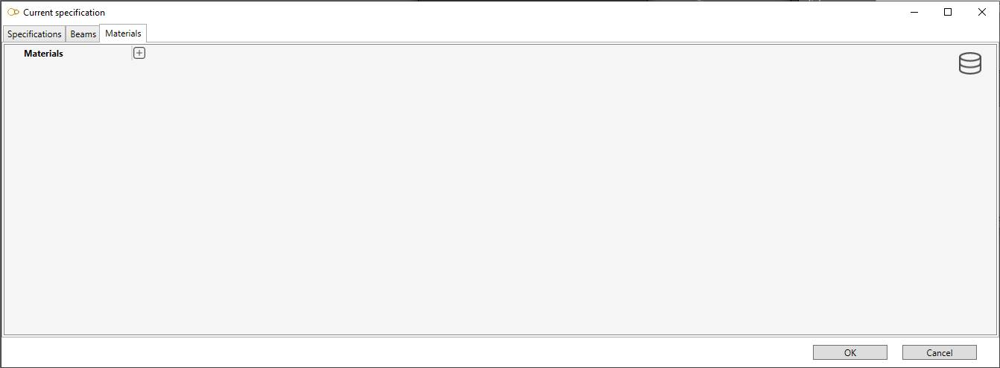

# Data

The **Data** window let you create all materials and all sections of the model.

## 1. New project

When starting a new modelisation, the **Data** window opens :

### 1.1 Material definition

Let's define a new material.

We recommand to select a material from **database** :

Click on the **Database** button, select a **Library** and a **Material**. The tables will be filled automatically :

>Only library with **Target** = Structure will be shown !

Click [here](https://documentation.metapiping.com/Settings/Databases/Materials.html) for more information about creation of library of materials.

### 1.2 Beam definition

Let's add a new beam section. Click on the **Database** button :

A window with all section appears. Select for example a **IPE 140** and press **OK**.

The **IPE 140** appears in the list with an image and all properties.

You can remove this section by clicking the **-** button.

Click [here](https://documentation.metapiping.com/Settings/Databases/Sections.html) for more information about creation of beam sections.

### 1.3 Specification

Finally, you can define the **Specification sections** of the model by defining pairs of Section/Material + description and color.

Click to **+** button, select the section, define a description (optional) and a color :

You can remove this specification by clicking the **-** button.

Click **OK** to validate the window.

You can now select this specification in the ribbon menu :

