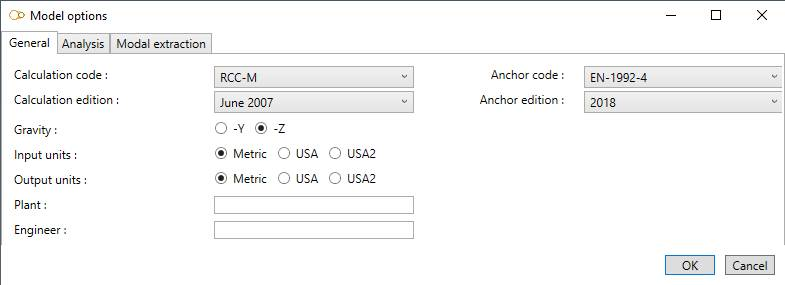
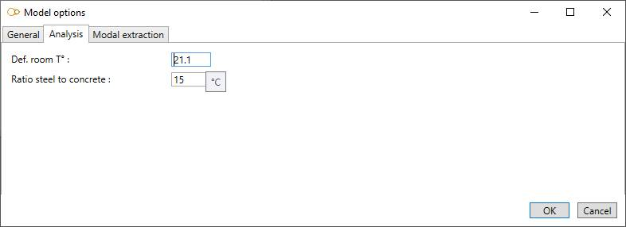
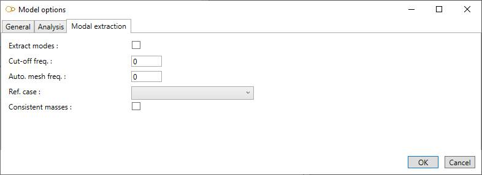

# Model options

## 1. General

This tab let you define the **Calculation code** and its **Edition**, the direction of the **gravity**, the input and output **Units**, the **Plant** name and the **Engineer** name.

If you need to verify anchors, you must also define the **Anchor code** and **Edition**.

## 2. Analysis

- **Def. room T°** : default room temperature (used to calculate thermal expansion)
- **Ratio steel to concrete** : ratio of steel to concrete modulus of elasticity (used during anchor verification)

    To know the UNIT of a property, just let the mouse over the cell.
    For example : °C for the room temperature.

## 3. Modal extraction

- **Extract modes** : check this option to extract the mode shapes
- **Cut-off freq.** : only the mode shapes below to the cut-off frequency are extracted 
- **Auto. mesh freq.** : if different from 0, additional mass points will be generated to ensure that the mode shapes up to this frequency are accurate. This frequency should be equal or larger than the cut-off frequency
- **Ref. case** : the Young modulus Eh used for the modal extraction is evaluated at the temperature of the reference case. Room temperature is used if not defined 
- **Consistent masses** : if checked, consistent mass matrix is used