# Structure

After creating a new **structure study** and pressing the **Edit** button, a window appear to define the calculation code :

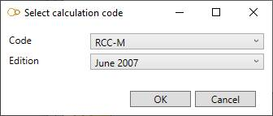

Set the **Code** and **Edition** and press **OK** : new tabs appear in the ribbon menu on top of the application :

- Structure
- Load - click [here](https://documentation.metapiping.com/Loads/Structure/index.html) to have more information about loading
- Review - click [here](https://documentation.metapiping.com/Review/Structure.html) to have more information about review tools
- Analysis - click [here](https://documentation.metapiping.com/Analysis/Structure.html) to have more information about analysis

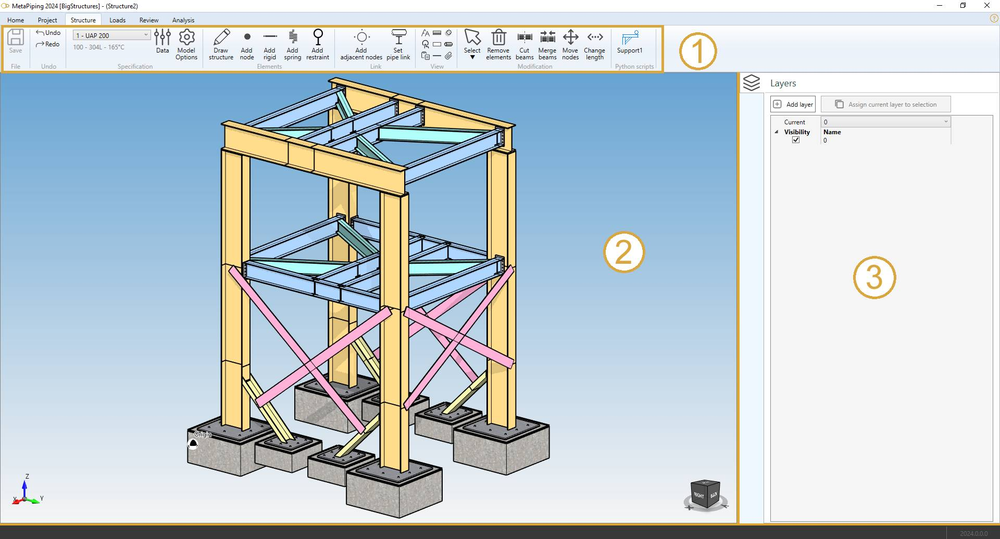

The **Structure** screen consists of a ribbon menu (1), a 3D visualization engine (2) and a data panel on the right (3).

>The **Data Panel** can be opened/closed with the shortcut **F2**

## 1. Ribbon menu

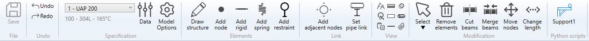

### 1.1 File

During the design of the model, every command is automatically saved in a temporary file (conception.~metaL).

You can decide to save the last modifications or cancel it and return to the study screen.

A floppy disk on the left side of the ribbon indicates the state of the file on disk :

 means that everything has been saved.

 means that something has changed and the MetaL need to be saved.

{: .warning }
>If the application crashes, MetaPiping will prompt to reopen the last modifications

### 1.2 Undo/Redo

Every command in MetaStructure is stored in a **command list**.

You can *navigate* through this list by pressing the **Undo/Redo** buttons.

### 1.3 Specification

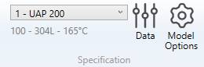

This group of controls let you define the current **Section/Material** for the next beams. 

You have an access to a window that defines the beam sections and materials for the current model.

You have an access to the model options (code, edition, calculation options...).

Click [here](https://documentation.metapiping.com/Structure/Specification/index.html) to have more information about the **Data** button and the **Model options** button.

### 1.4 Elements & Link

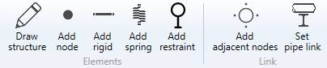

Click [here](https://documentation.metapiping.com/Structure/Elements/index.html) to have more information about element creation and link between piping nodes and structure nodes.

### 1.5 View options

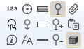

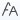 show/hide the node name

 show/hide the node point

 copy the 3D view to the clipboard

 show the structure in shaded mode

 show the structure in hidden lines mode

 show the structure in wireframe mode

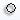 show/hide the shadows

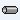 show/hide the silhouette drawing

 show/hide the linked study models 

### 1.6 Modification tools

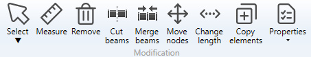

Click [here](https://documentation.metapiping.com/Structure/Modification.html) to have more information about all modification tools.

### 1.7 Python scripts

MetaStructure lets you create your own **tools**.

If a tool is missing, user can create his own **command** that can interact with the user and modify the selected elements or the whole model.

MetaStructure will take care of the Undo/Redo mechanism.

Click [here](https://documentation.metapiping.com/Python/design.html) to have more information about python script creation.

[See an example of a Design script](https://documentation.metapiping.com/Python/Samples/support.html) : Create a beam support of a piping on a node

---

## 2. 3D Visualization

MetaStructure is equipped with a powerful 3D engine :

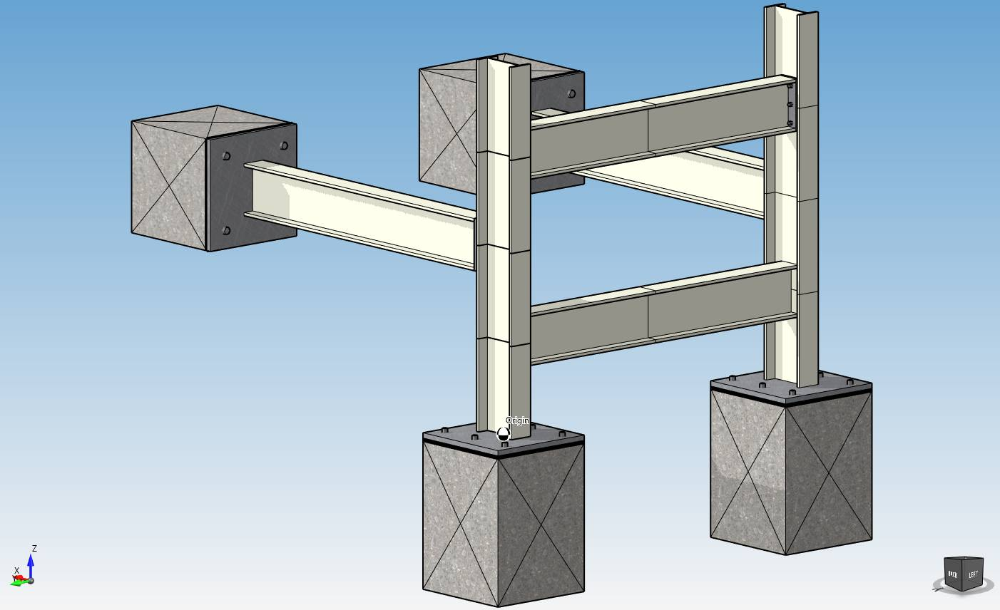

### 2.1 Navigation

You navigate inside the view with the **middle button** of the mouse pressed :

Hold down the **CTRL key** during navigation to translate the view.

You zoom in by scrolling the mouse wheel up :

You zoom out by scrolling the mouse wheel down :

You zoom all by **double click** the mouse wheel button :

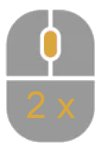

### 2.2 Axis

The **global axis** are shown in the bottom left corner of the screen :

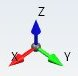

### 2.3 Predefined views

An interactive **cube** with predefined views is shown in the bottom right corner of the screen :

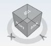

- Click on top corners of the cube to change to predefined axonometric view.
- Click twice on the faces of the cube to change to 2D views.

---

## 3. Data panel

>The **Data Panel** can be opened/closed with the shortcut **F2**

### 3.1 Layers

MetaStructure lets you simplify your visualization by using the **Layer** concept :

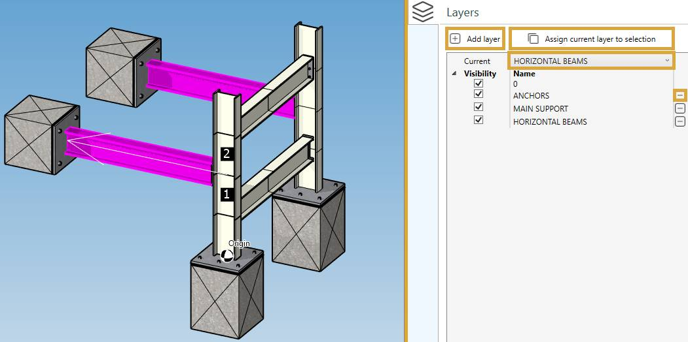

By default, all elements are assigned to **Layer 0**.

To create a new layer, click on **Add layer** button.

Give it a name, for example "HORIZONTAL BEAMS".

The layer "HORIZONTAL BEAMS" will appear in the list of layers and will become the current layer.

To modify the layer of objects, select elements and/or restraints and click on **Assign current layer to selection** button.

If you decide to remove a layer, click on **-** button next to the layer name. All elements and restraints of this layer will be assigned to the default **Layer 0**.

You can now show/hide elements and restraints by activating/deactivating the visibility buttons :

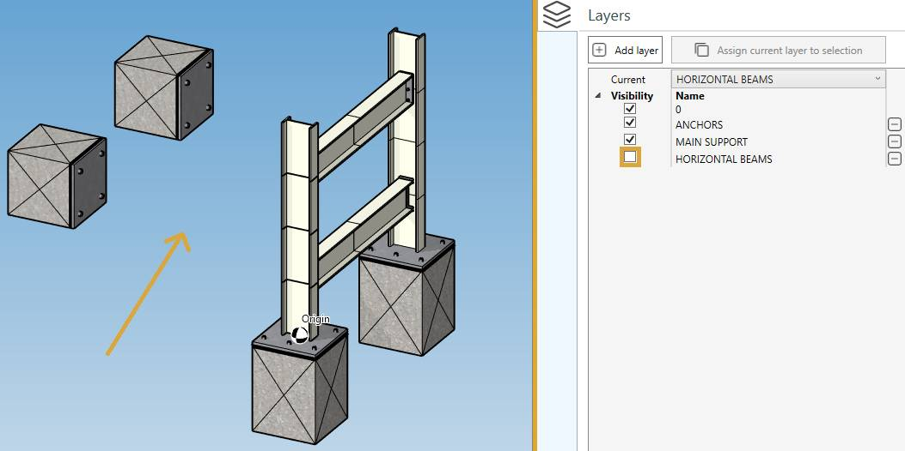

>All layer manipulations support Undo/Redo mechanism.